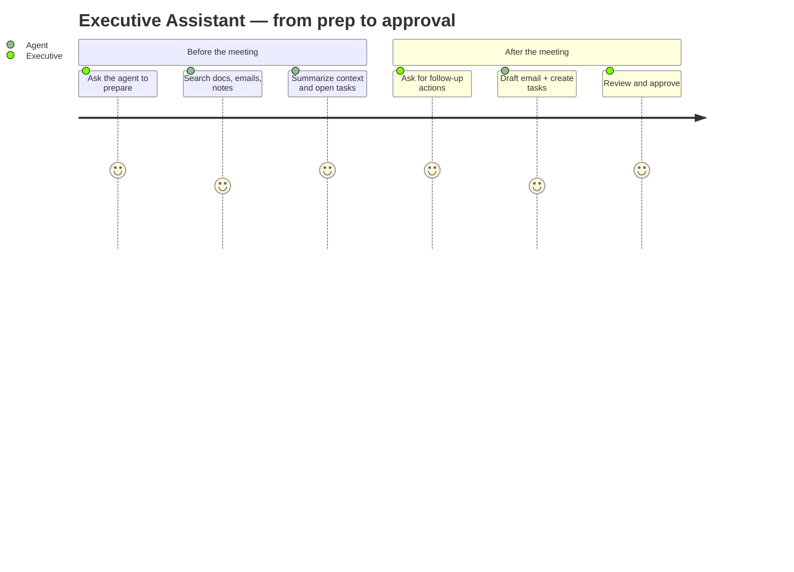
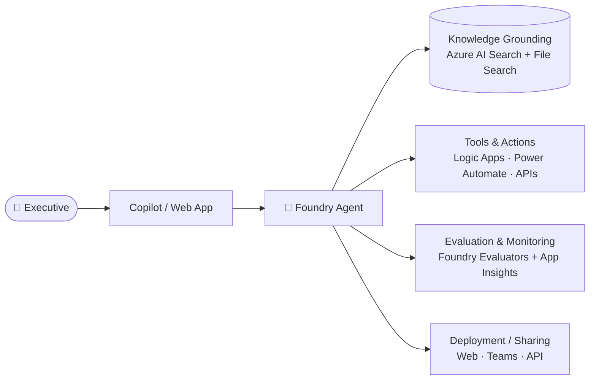

# Executive Assistant Agent MicroHack

> **Build, ground, evaluate, and deploy an AI Executive Assistant using Microsoft Foundry.**

Welcome to the **Executive Assistant Agent MicroHack** — a hands-on, challenge-based journey that shows you how to build a production-ready AI agent on **Microsoft Foundry**. In ~4 hours you will build an assistant that summarizes meetings, drafts follow-up emails, searches enterprise knowledge, and triggers business workflows.

🌐 **Visual landing page:** open [`index.html`](./index.html) in a browser (or via GitHub Pages).
📘 **Docs landing page:** [`landing-page.md`](./landing-page.md).

---

## What you will build

An **Executive Assistant Agent** that can:

- 📝 Summarize meetings and generate action items.
- ✉️ Draft follow-up emails.
- 🔎 Search enterprise knowledge (docs, emails, notes).
- ⚙️ Trigger business workflows (create tasks, book time, send updates).
- 🧑‍💼 Support executive assistant productivity scenarios end-to-end.

## Challenges

| # | Challenge | Foundry feature | Link |
| --- | --- | --- | --- |
| 1 | Build the Agent | Foundry Agent Service (Model + Instructions) | [docs/challenge-1-build-agent.md](docs/challenge-1-build-agent.md) |
| 2 | Ground the Agent with Knowledge | Foundry IQ + Azure AI Search + File Search | [docs/challenge-2-grounding.md](docs/challenge-2-grounding.md) |
| 3 | Add Tools and Actions | Tools catalog + Logic Apps + Functions | [docs/challenge-3-tools-actions.md](docs/challenge-3-tools-actions.md) |
| 4 | Evaluate and Improve the Agent | Foundry Evaluators + Content Safety | [docs/challenge-4-evaluation.md](docs/challenge-4-evaluation.md) |
| 5 | Deploy and Share the Agent | Web App / Teams / API endpoint | [docs/challenge-5-deploy-share.md](docs/challenge-5-deploy-share.md) |

## User journey

The agent supports a six-step executive workflow:



See [assets/user-journey.md](assets/user-journey.md) for the full narrative.

## Architecture



See [assets/architecture-diagram.md](assets/architecture-diagram.md) for the annotated version.

## Prerequisites

- Microsoft Foundry access (project in [ai.azure.com](https://ai.azure.com)).
- An Azure subscription or a Foundry sandbox.
- Basic understanding of agents (model + instructions + tools).
- A few sample documents for grounding (meeting notes, briefs, policies — anything you'd want the assistant to know).
- **Optional:** VS Code + GitHub Copilot.

## Learning objectives

You will learn how to:

- 🏗️ **Build** an agent in Microsoft Foundry.
- 📚 **Ground** the agent with enterprise knowledge.
- 🔌 **Connect** tools and actions.
- 📊 **Evaluate** agent quality and safety.
- 🚀 **Deploy and share** the finished solution.

## Repository structure

```
├── README.md                     ← you are here
├── landing-page.md               ← Markdown landing page (GitHub-friendly)
├── index.html                    ← Polished HTML landing page (GitHub Pages ready)
├── docs/
│   ├── challenge-1-build-agent.md
│   ├── challenge-2-grounding.md
│   ├── challenge-3-tools-actions.md
│   ├── challenge-4-evaluation.md
│   └── challenge-5-deploy-share.md
└── assets/
    ├── architecture-diagram.md   ← annotated architecture
    └── user-journey.md           ← full user story
```

## How to use this repo

1. **Start with this README** to understand the theme.
2. Open [`landing-page.md`](./landing-page.md) for the documentation-based landing page.
3. Open [`index.html`](./index.html) in a browser (or publish to GitHub Pages) for the visual landing page.
4. Work through the challenges in order:
   1. [Build the Agent](docs/challenge-1-build-agent.md)
   2. [Ground the Agent](docs/challenge-2-grounding.md)
   3. [Add Tools and Actions](docs/challenge-3-tools-actions.md)
   4. [Evaluate and Improve](docs/challenge-4-evaluation.md)
   5. [Deploy and Share](docs/challenge-5-deploy-share.md)

## Getting started

```bash
# Clone
git clone https://github.com/<your-org>/MS-Foundry-Microhack.git
cd MS-Foundry-Microhack

# View the visual landing page locally
start index.html   # Windows
# open index.html  # macOS

# Or preview the markdown landing page in VS Code
code landing-page.md
```

## License

MIT.
