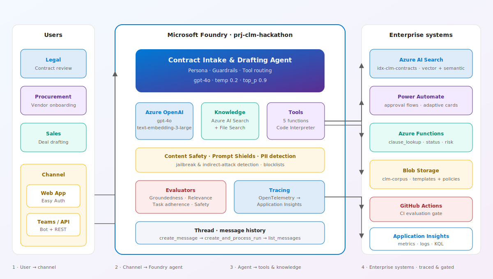
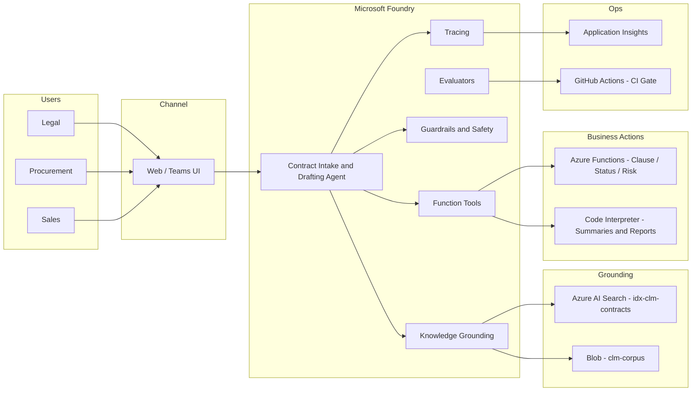

# Contract Lifecycle Management with Microsoft Foundry

> A production-style **Microsoft Foundry MicroHack** that walks you through building an enterprise-grade **Contract Lifecycle Management (CLM) Assistant** — from an empty Foundry project to a shipped Web App / Teams app / API.

[](https://ai.azure.com)
[](https://www.python.org)
[](https://github.com/priyanka405/MS-Foundry-Microhack)
[](./LICENSE)

---

## Landing page

> **Open the interactive landing page → <[https://github.com/priyanka405/MS-Foundry-Microhack](https://github.com/priyanka405/MS-Foundry-Microhack)>**

[](https://github.com/priyanka405/MS-Foundry-Microhack)

<p align="center">
  <a href="https://github.com/priyanka405/MS-Foundry-Microhack">
    
  </a>
  &nbsp;
  <a href="./index.html">
    
  </a>
</p>

Click the image or the button above to launch the full-page site (dark mode, Mermaid diagrams, individual challenge pages, and a QR code that opens the microhack on your phone).

---

## Hero

Build the **Contract Intake & Drafting Agent** — the AI copilot Legal and Procurement wish they already had. Nine hands-on challenges take you from *"I have an Azure subscription"* all the way to a shipped, audited, governed AI assistant.

Every challenge is fully documented for both the **Foundry portal (low-code)** and the **Foundry SDK in Python (pro-code)**, so architects, engineers, and product folks can all follow along.

## Table of contents

- [Landing page](#landing-page)
- [Hackathon overview](#hackathon-overview)
- [Business scenario](#business-scenario)
- [Learning objectives](#learning-objectives)
- [Business value](#business-value)
- [Solution architecture](#solution-architecture)
  - [Functional architecture (business capabilities)](#functional-architecture-business-capabilities)
  - [Technical architecture (Azure services)](#technical-architecture-azure-services)
  - [Agent tools](#agent-tools)
  - [Architecture design decisions](#architecture-design-decisions)
- [Challenge roadmap](#challenge-roadmap)
- [Prerequisites](#prerequisites)
- [Estimated duration](#estimated-duration)
- [Skills you will learn](#skills-you-will-learn)
- [Success outcomes](#success-outcomes)
- [Repository structure](#repository-structure)
- [Getting started](#getting-started)
- [Resources](#resources)

## Hackathon overview

Organizations process hundreds of contracts every month. Legal and Procurement need help with:

- Contract creation and drafting
- Contract review and clause analysis
- Compliance verification
- Approval routing
- Contract tracking, renewals, and expirations
- Risk identification

You will build a single **Contract Lifecycle Management Assistant** on Microsoft Foundry that owns all of the above — grounded on your organization's own templates, clause library, and policies.

## Business scenario

**Contoso Global** is a multinational with 40,000 employees, 12,000 active contracts, and 400+ new agreements per month. Their current CLM process is scattered across SharePoint, email, and three different spreadsheets. The pain points:

- Legal spends **~35%** of its time answering "what does clause X in contract Y say?".
- Procurement misses **~11%** of auto-renewals every year, costing millions.
- Average new-contract turnaround is **17 business days**.
- No consistent way to compare an incoming counterparty draft against the enterprise standard.

Your job: ship a **Contract Lifecycle Management Assistant** that turns this into a same-day, self-service, auditable workflow — while never crossing the line into legal advice or unilateral approvals.

## Learning objectives

By the end of this hackathon you will be able to:

1. Stand up an Azure AI Foundry project with a deployed model, indexed corpus, and enabled tracing.
2. Build a grounded agent with a strong persona and refusal behavior.
3. Ground the agent on enterprise content using Azure AI Search and File Search — with citations.
4. Extend the agent with five tools: **Contract Search** (Azure AI Search), **Clause Analysis** (Azure AI Foundry Models), **Contract Repository** (SharePoint), **Approval Routing** (Power Automate), **Contract Status** (Dataverse / SQL).
5. Protect the agent with Prompt Shields, PII detection, and app-layer blocklists.
6. Trace every prompt, retrieval, tool call, and response into Application Insights.
7. Evaluate on a fixed dataset and enforce a deployment gate.
8. Optimize model, prompt, retrieval, and cost with a repeatable evaluation loop.
9. Publish the assistant as a Web App, a Teams app, or an API endpoint.

## Business value

| KPI | Baseline (typical) | With this solution (target) |
| --- | --- | --- |
| Time to first draft (NDA / MSA / SOW) | 3–5 days | Under 10 minutes |
| Legal time on "what does clause X say?" | ~35% | Under 10% |
| Missed auto-renewals per year | ~11% | Under 2% |
| Contract turnaround (draft → signature) | 17 business days | Under 5 business days |
| Audit trail for AI-assisted actions | Ad hoc | 100% traced in App Insights |

## Solution architecture

The solution is described at two complementary levels. The diagram is unchanged; the two lenses below explain **what the agent does for the business** and **which Azure services power it**.

### Functional architecture (business capabilities)

Legal, Procurement, and Sales users interact with **one Contract Lifecycle Management Agent**. The agent exposes five business capabilities:

1. **Intake & drafting** — turn a plain-English request into a first draft using approved templates.
2. **Contract search & review** — find contracts, quote clauses, compare against the enterprise standard.
3. **Clause analysis** — explain, rewrite, flag risk on any clause using the underlying Foundry model.
4. **Approval routing** — kick off the correct approval flow (Legal / Procurement / Finance) and track it to closure.
5. **Contract status & renewals** — report on any contract's lifecycle stage and surface upcoming renewal / expiration events.

Everything is grounded on the enterprise corpus, guarded by content safety, and audited end-to-end. The agent **never** advises on legal strategy and **never** self-approves.

### Technical architecture (Azure services)

| Layer | Azure service | Purpose |
| --- | --- | --- |
| Channel | Web App (Easy Auth) / Teams / API | User surface |
| Agent runtime | **Azure AI Foundry** (Agents + Models) | Instructions, tool orchestration, model calls |
| Model | **Azure AI Foundry Models** (gpt-4o / gpt-4o-mini) | Reasoning, drafting, clause analysis |
| Grounding | **Azure AI Search** + **Azure Blob Storage** | Vector + semantic hybrid retrieval over the corpus |
| Business system | **SharePoint** | Approved templates, executed contracts, DMS |
| Workflow | **Power Automate** | Approval routing, notifications, renewal reminders |
| System of record | **Dataverse** (or Azure SQL) | Contract status, owner, stage, renewal date |
| Safety | **Azure AI Content Safety** + **Prompt Shields** | Jailbreak, PII, restricted-clause enforcement |
| Observability | **Application Insights** + OpenTelemetry | Traces, KQL, cost + latency dashboards |
| CI gate | **GitHub Actions** + **Azure AI Evaluation SDK** | Groundedness / safety / tool accuracy gate |



Every challenge builds one slice of this picture. By the end, the whole diagram is real.

### Agent tools

The Contract Lifecycle Management Agent is powered by five explicit tools. Every user request is answered by orchestrating one or more of them.

| # | Tool | Connected service | Purpose | Expected outcome |
| --- | --- | --- | --- | --- |
| 1 | **Contract Search Tool** | Azure AI Search | Hybrid (vector + semantic) retrieval across the contract corpus | Grounded answers with citations to the exact clause or paragraph |
| 2 | **Clause Analysis Tool** | Azure AI Foundry Models | LLM-driven clause explanation, rewrite, and risk flagging against the approved-clause library | Plain-language explanations and risk callouts |
| 3 | **Contract Repository Tool** | SharePoint | Read approved templates, executed contracts, and policy documents from the enterprise DMS | Correct template pulled by contract type; executed contracts retrieved for review |
| 4 | **Approval Routing Tool** | Power Automate | Kick off Legal / Procurement / Finance approval flows and return the approval id | Approval routed to the correct role; status is tracked to closure |
| 5 | **Contract Status Tool** | Dataverse (or Azure SQL) | Read / update contract lifecycle state: stage, owner, renewal date, expiry | Deterministic status answers; renewal reminders never miss |

Every tool call is traced end-to-end into Application Insights (Challenge 5) and scored by the evaluation gate for **tool call accuracy** (Challenge 6).

### Architecture design decisions

- **One agent, many tools.** A single agent owns the CLM domain. Multiple agents would fragment the audit trail and duplicate policy plumbing.
- **Power Automate for approval routing.** Approval flows live in Microsoft 365 (SharePoint, Teams, Outlook approvals). Power Automate matches those primitives natively and is the native Foundry connector.
- **SharePoint as the contract repository.** Contracts, templates, and policies are already there. Adding a second repository would create drift.
- **Dataverse (or Azure SQL) for contract status.** Contract state is structured, queryable, and mutated by workflows — Dataverse gives a low-code CRUD surface without hand-rolled APIs.
- **Foundry Models for clause analysis, not a custom API.** Clause analysis is a language task. Pushing it into an external service would add a hop, cost, and drift from prompt engineering.
- **Azure Functions are used only where a language model genuinely cannot do the job** — specifically, the *scheduled* renewal-reminder job in Challenge 8, which is a queue-driven batch process.
- **Grounding first, tools second.** Retrieval (Azure AI Search + Blob) fires before any action-taking tool, so every approval, status change, or draft is anchored to real content.
- **Safety wraps every tool.** Prompt Shields, Content Safety, and PII detection sit between the user and every tool call — there is no "unsafe fast path".

## Challenge roadmap

| # | Challenge | Focus | Path |
| --- | --- | --- | --- |
| 0 | [Setup](./challenges/challenge-0-setup.md) | Foundry project, model, Search, tracing, corpus | Low-code + Pro-code |
| 1 | [Build Agent — Contract Intake & Drafting](./challenges/challenge-1-build-agent.md) | Persona, instructions, refusal behavior | Low-code + Pro-code |
| 2 | [Knowledge Grounding](./challenges/challenge-2-knowledge-grounding.md) | Azure AI Search + File Search with citations | Low-code + Pro-code |
| 3 | [Tools & Actions](./challenges/challenge-3-tools-actions.md) | Contract Search, Clause Analysis, Contract Repository, Approval Routing, Contract Status | Low-code + Pro-code |
| 4 | [Guardrails](./challenges/challenge-4-guardrails.md) | Prompt Shields, PII, template enforcement | Low-code + Pro-code |
| 5 | [Observability](./challenges/challenge-5-observability.md) | Tracing, monitoring, tool telemetry | Low-code + Pro-code |
| 6 | [Evaluation](./challenges/challenge-6-evaluation.md) | Groundedness, safety, tool accuracy | Low-code + Pro-code |
| 7 | [Optimization](./challenges/challenge-7-optimization.md) | Model, prompt, retrieval, cost, latency | Low-code + Pro-code |
| 8 | [Publish](./challenges/challenge-8-publish.md) | Web App, Teams, API endpoint | Low-code + Pro-code |

Every challenge follows the same anatomy: **Context → Objective → Learning Outcome → Prerequisites → Architecture Diagram → Low-Code Path → Pro-Code Path → Portal Walkthrough & Deployment Checklist**.

## Prerequisites

Before you start Challenge 0, make sure you have:

- An **Azure subscription** with permission to create resource groups and role assignments (Owner, or Contributor + User Access Administrator).
- Access to **Microsoft Foundry** at [`ai.azure.com`](https://ai.azure.com).
- Quota to deploy **gpt-4o** or **gpt-4o-mini** in your target region (≥ 30k TPM recommended).
- **Python 3.11+**, **Git**, and **VS Code** with the Python + Azure extensions.
- **Azure CLI** (`az login` works).
- (For pro-code path) `pip install -r requirements.txt`.
- (For Challenge 3 & 5) A Microsoft 365 tenant with **Power Automate**, **SharePoint**, and **Dataverse** (or a stub SQL database) enabled — or the ability to stub the equivalent HTTP endpoints.

## Estimated duration

| Segment | Time |
| --- | --- |
| Challenge 0 — Setup | ~45 min |
| Challenge 1 — Build Agent | ~45 min |
| Challenge 2 — Knowledge Grounding | ~60 min |
| Challenge 3 — Tools & Actions | ~75 min |
| Challenge 4 — Guardrails | ~45 min |
| Challenge 5 — Observability | ~45 min |
| Challenge 6 — Evaluation | ~45 min |
| Challenge 7 — Optimization | ~45 min |
| Challenge 8 — Publish | ~60 min |
| **Total** | **~8 hours** |

An "Explorer" (low-code only) team can finish Challenges 0–5 in about 4 hours.

## Skills you will learn

- **Foundry project management** — creating projects, model deployments, connections, and role assignments.
- **Agent design** — instructions, personas, refusal behavior, tool routing.
- **Retrieval-Augmented Generation** — vector + semantic hybrid, chunking, top-k tuning, citations.
- **Function calling** — wiring Power Automate flows, SharePoint / Dataverse connectors, and Foundry built-in tools into an agent.
- **Guardrails** — Prompt Shields, Content Safety, PII detection, app-layer blocklists.
- **Observability** — OpenTelemetry, Application Insights, KQL, cost tracking.
- **Evaluation** — groundedness, task adherence, safety, tool call accuracy, gate design.
- **Optimization** — model + prompt + retrieval + cost sweeps with reproducible runs.
- **Deployment** — Web App with Easy Auth, Teams manifest, API endpoint with Managed Identity.

## Success outcomes

You have "shipped" this MicroHack when:

- Your CLM agent answers the 15-question evaluation set with citations and hits the deployment gate.
- The full end-to-end scenario (intake → draft → retrieve clause → route approval → update status) works from a single Foundry thread.
- Every prompt, retrieval, tool call, and response is visible in Application Insights.
- A Web App, Teams app, or authenticated API endpoint serves the assistant to a pilot user.
- GitHub Actions blocks a deploy if any gate metric regresses.

## Repository structure

```
MS-Foundry-Microhack/
├── README.md                         <- this file
├── index.html                        <- GitHub Pages landing (mirrors README, dark mode + Mermaid)
├── assets/
│   ├── css/style.css                 <- Fluent-inspired styling with light/dark theme
│   ├── js/main.js                    <- Nav, theme toggle, Mermaid init, copy buttons
│   └── README.md                     <- Where to drop screenshots and architecture PNGs
├── challenges/
│   ├── challenge-0-setup.md
│   ├── challenge-1-build-agent.md
│   ├── challenge-2-knowledge-grounding.md
│   ├── challenge-3-tools-actions.md
│   ├── challenge-4-guardrails.md
│   ├── challenge-5-observability.md
│   ├── challenge-6-evaluation.md
│   ├── challenge-7-optimization.md
│   └── challenge-8-publish.md
├── app/                              <- Pro-code (Python) reference implementation
│   ├── config.py
│   ├── contract_agent.py
│   ├── grounding.py
│   ├── tools.py
│   ├── monitoring.py
│   ├── evaluation.py
│   └── sample_run.py
├── data/                             <- Sample corpus for Challenges 2 and 6
│   ├── contract_templates/
│   ├── approved_clauses/
│   ├── policies/
│   └── test_cases/evaluation_dataset.jsonl
├── docs/                             <- Facilitator + student guides (optional)
├── requirements.txt
├── .env.example
└── .gitignore
```

## Getting started

```powershell
# 1. Clone
git clone https://github.com/priyanka405/MS-Foundry-Microhack.git
cd MS-Foundry-Microhack

# 2. Python env
python -m venv .venv
.\.venv\Scripts\Activate.ps1
pip install -r requirements.txt

# 3. Configure
Copy-Item .env.example .env
# then fill AZURE_AI_PROJECT_CONNECTION_STRING, AZURE_OPENAI_DEPLOYMENT, ...

# 4. Smoke test
python -m app.sample_run --smoke

# 5. Open the landing page locally
Start-Process index.html
```

Then jump into [Challenge 0 — Setup](./challenges/challenge-0-setup.md).

## Resources

- **Microsoft Foundry**: <https://ai.azure.com>
- **Foundry docs**: <https://learn.microsoft.com/azure/ai-foundry/>
- **Azure AI Agents SDK (Python)**: <https://learn.microsoft.com/python/api/overview/azure/ai-agents-readme>
- **Azure AI Search**: <https://learn.microsoft.com/azure/search/>
- **Azure AI Evaluation SDK**: <https://learn.microsoft.com/azure/ai-foundry/how-to/develop/evaluate-sdk>
- **Content Safety + Prompt Shields**: <https://learn.microsoft.com/azure/ai-services/content-safety/>
- **Reference hackathon (style inspiration)**: <https://martaldsantos.github.io/foundry-hackathon/>

---

Made with care for the Microsoft Foundry community. This repository is provided under the MIT license.
