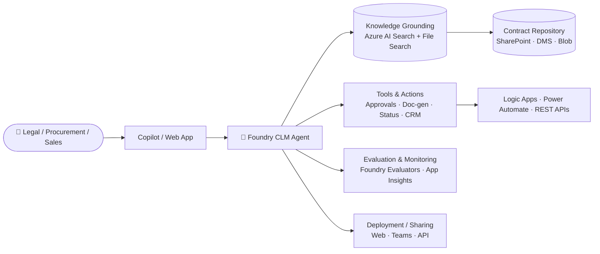
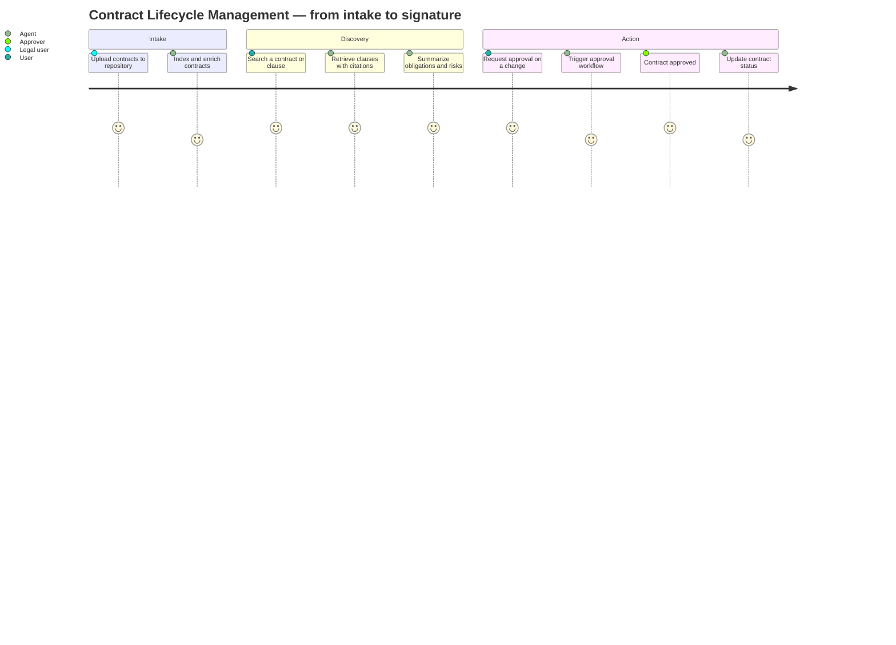

# Contract Lifecycle Management Agent MicroHack

> **Build an AI-powered Contract Lifecycle Management solution using Microsoft Foundry.**

Welcome to the **Contract Lifecycle Management (CLM) Agent MicroHack** — a hands-on, challenge-based journey that shows you how to build a production-ready AI agent on **Microsoft Foundry**. In one focused session, you will build an assistant that searches contracts, retrieves clauses, identifies risks, routes approvals, and generates contract documents for legal, procurement, and sales teams.

🌐 **Visual landing page:** open [`index.html`](./index.html) in a browser (or via GitHub Pages).
📘 **Docs landing page:** [`landing-page.md`](./landing-page.md).

---

## Overview

The **Contract Lifecycle Management Agent** is an AI teammate for legal, procurement, sales, and contract-management teams. It helps them work across the full contract lifecycle — from *"what do we have on file with Contoso?"* to *"draft an amendment and route it for approval"* — grounded in the enterprise contract repository and governed by Foundry evaluators and Content Safety.

## Business problem

Enterprise contract portfolios are large, unstructured, and expensive to reason about:

- 🗂️ Thousands of contracts spread across SharePoint, DMS, email, and legacy shared drives.
- 🕒 Legal reviewers spend hours per contract locating clauses, comparing versions, and drafting summaries.
- ⚠️ Missing or non-standard clauses (liability caps, GDPR, termination for convenience) create hidden risk.
- 🔁 Approval routing is manual, inconsistent, and slow.
- 📉 Business stakeholders can't self-serve simple questions about their own agreements.

The CLM Agent fixes this by combining **Foundry grounding**, **enterprise tools**, and **evaluated, governed deployment** into a single assistant embedded where the business already works.

## What you will build

A **Contract Lifecycle Management Agent** that can:

- 🔎 **Search contracts** across the enterprise repository.
- 📄 **Retrieve clauses** (termination, liability, indemnity, GDPR, payment terms).
- ⚖️ **Compare agreements** side by side.
- 🧠 **Explain contract terms** in plain business language.
- 📝 **Draft contract summaries** with obligations and key dates.
- 🚦 **Route approvals** through Logic Apps / Power Automate.
- 🏗️ **Generate contract documents** from templates (NDAs, SOWs, MSAs).
- 📊 **Track contract status** across the lifecycle.
- ❓ **Answer questions** about the contract repository.
- 🚨 **Identify risks** and missing/non-standard clauses.

## Solution architecture



See [`assets/architecture-diagram.md`](assets/architecture-diagram.md) for the annotated version.

## Challenges

| # | Challenge | Foundry feature | Link |
| --- | --- | --- | --- |
| 1 | Build the Agent | Foundry Agent Service (Model + Instructions) | [docs/challenge-1-build-agent.md](docs/challenge-1-build-agent.md) |
| 2 | Ground the Agent with Knowledge | Foundry IQ + Azure AI Search + File Search | [docs/challenge-2-grounding.md](docs/challenge-2-grounding.md) |
| 3 | Tools and Actions | Tools catalog + Logic Apps + Power Automate + Functions | [docs/challenge-3-tools-actions.md](docs/challenge-3-tools-actions.md) |
| 4 | Evaluation and Optimization | Foundry Evaluators + Content Safety | [docs/challenge-4-evaluation.md](docs/challenge-4-evaluation.md) |
| 5 | Deploy and Share | Foundry Deploy · Web · Teams · API endpoint | [docs/challenge-5-deploy-share.md](docs/challenge-5-deploy-share.md) |

## User journey

The CLM Agent supports the full contract lifecycle — nine steps, one agent:



See [`assets/user-journey.md`](assets/user-journey.md) for the full narrative with example prompts and expected outputs.

## Prerequisites

- 🧠 **Microsoft Foundry** access — a project on [ai.azure.com](https://ai.azure.com).
- ☁️ An **Azure subscription** or a Foundry sandbox.
- 📄 A handful of **sample contracts** for grounding (MSA, NDA, SOW, vendor agreements — real or synthetic).
- 📚 **Basic understanding** of what an agent is (model + instructions + tools).
- 🧰 **Optional:** VS Code, GitHub Copilot, `az` CLI for the SDK samples.

## Learning objectives

You will learn how to:

- 🏗️ **Build** a Contract Lifecycle Management Agent in Microsoft Foundry.
- 📚 **Ground** the agent with an enterprise contract repository (RAG on Azure AI Search + File Search).
- 🔌 **Connect** tools and actions — approvals, doc-gen, status tracking.
- 📊 **Evaluate** agent quality, groundedness, and safety — and set a real deployment gate.
- 🚀 **Deploy and share** the finished solution to Web, Teams, and an API endpoint.

## Repository structure

```
├── README.md                     ← you are here
├── landing-page.md               ← Markdown landing page (GitHub-friendly)
├── index.html                    ← Polished HTML landing page (GitHub Pages ready)
├── docs/
│   ├── challenge-1-build-agent.md
│   ├── challenge-2-grounding.md
│   ├── challenge-3-tools-actions.md
│   ├── challenge-4-evaluation.md
│   └── challenge-5-deploy-share.md
└── assets/
    ├── architecture-diagram.md   ← annotated architecture
    └── user-journey.md           ← full user story
```

## Getting started

```bash
# Clone
git clone https://github.com/<your-org>/MS-Foundry-Microhack.git
cd MS-Foundry-Microhack

# View the visual landing page locally
start index.html   # Windows
# open index.html  # macOS

# Or preview the markdown landing page in VS Code
code landing-page.md
```

Then work through the challenges in order:

1. [Build the Agent](docs/challenge-1-build-agent.md)
2. [Ground the Agent with Knowledge](docs/challenge-2-grounding.md)
3. [Tools and Actions](docs/challenge-3-tools-actions.md)
4. [Evaluation and Optimization](docs/challenge-4-evaluation.md)
5. [Deploy and Share](docs/challenge-5-deploy-share.md)

## References

- [Microsoft Foundry](https://ai.azure.com) — project home for building agents.
- [Azure AI Foundry documentation](https://learn.microsoft.com/azure/ai-foundry/) — agents, evaluation, grounding, deploy.
- [Azure AI Search](https://learn.microsoft.com/azure/search/) — vector + hybrid retrieval for RAG.
- [Foundry Evaluators](https://learn.microsoft.com/azure/ai-foundry/concepts/evaluation-metrics-built-in) — groundedness, relevance, safety.
- [Azure Content Safety](https://learn.microsoft.com/azure/ai-services/content-safety/) — Prompt Shields and jailbreak defenses.
- [Logic Apps](https://learn.microsoft.com/azure/logic-apps/) — approval workflows.
- [Power Automate](https://learn.microsoft.com/power-automate/) — business-user flows.

## License

MIT.
