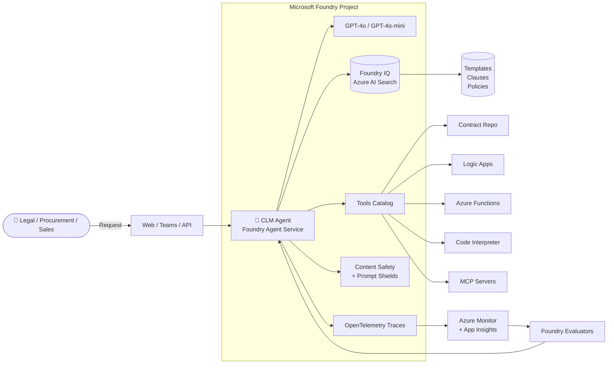

# MS-Foundry-Microhack

> **Microsoft Foundry: Contract Lifecycle Management (CLM) Agent — From Prototype to Production**

Build a multi-agent **Contract Lifecycle Management** system end-to-end inside **one Microsoft Foundry project**. Every challenge ships with a **🟢 Low-Code** (Foundry portal) and **🔵 Pro-Code** (VS Code + Azure AI Projects SDK) track — pick your lane per challenge.

📖 **Landing page (GitHub Pages ready):** [docs/index.md](docs/index.md)

---

## Why this MicroHack

Contract Lifecycle Management is the perfect Foundry use case: it is document-heavy, workflow-heavy, risk-heavy, and every enterprise has one. In ~5 hours you will move from *"prompt in a Playground"* to a **governed, observable, evaluated, and deployed** agent.

**Expected business impact**

- ~**30–50%** faster contract cycle time
- **15–30%** less outside-counsel rework
- **2–5%** reduction in revenue leakage
- Full auditability of clause deviations

---

## Architecture



---

## Quick start

```bash
# 1. Clone
git clone https://github.com/<your-org>/MS-Foundry-Microhack.git
cd MS-Foundry-Microhack

# 2. Log in and pick a subscription
az login
az account set --subscription "<your-sub-id>"

# 3. Deploy the base infrastructure (Foundry project, model, Search, App Insights)
az group create -n rg-clm-microhack -l swedencentral
az deployment group create \
  -g rg-clm-microhack \
  -f infra/main.bicep \
  -p infra/main.parameters.json

# 4. Open Challenge 0 and go
code challenges/challenge0-setup/README.md
```

Prefer the **portal**? Skip step 3 — Challenge 0 walks the low-code provisioning path.

---

## Repository structure

```
MS-Foundry-Microhack/
├── README.md                       ← you are here
├── docs/
│   └── index.md                    ← GitHub Pages landing page
├── infra/                          ← Bicep IaC (Foundry, model, Search, Storage, App Insights)
│   ├── main.bicep
│   ├── main.parameters.json
│   └── modules/
│       ├── foundry.bicep
│       ├── search.bicep
│       ├── storage.bicep
│       └── monitoring.bicep
├── assets/
│   ├── TOOLS.md                    ← catalog of tools used in Challenge 3
│   ├── contract-register.md        ← Excel schema for the CLM register
│   ├── templates/                  ← NDA, MSA, SOW (markdown)
│   ├── clause-library/             ← approved clauses (liability, indemnity, termination, payment)
│   └── policies/                   ← legal, procurement, compliance policy docs
├── challenges/
│   ├── challenge0-setup/           ← Provision Foundry + model + Search + monitoring
│   ├── challenge1-build-agent/     ← Contract Intake & Drafting Agent
│   ├── challenge2-grounding/       ← Foundry IQ / Azure AI Search grounding
│   ├── challenge3-tools-actions/   ← Search, Logic Apps, Functions, Code Interpreter, MCP
│   ├── challenge4-guardrails/      ← PII, prompt-injection, task adherence
│   ├── challenge5-observability/   ← OTel + App Insights + Foundry traces
│   ├── challenge6-evaluation/      ← Built-in evaluators, 85% task-adherence gate
│   ├── challenge7-optimization/    ← Model + prompt + retrieval + cost
│   └── challenge8-publish/         ← Web App / Teams / API endpoint
├── coach-guide/README.md           ← facilitator notes, timings, common pitfalls
├── student-guide/README.md         ← participant survival guide
└── solution-guide/README.md        ← reference answers + multi-agent stretch goal
```

---

## Challenge index

| # | Title | Duration | Link |
| --- | --- | --- | --- |
| 0 | Setup | 30 min | [challenges/challenge0-setup](challenges/challenge0-setup/README.md) |
| 1 | Build Agent | 40 min | [challenges/challenge1-build-agent](challenges/challenge1-build-agent/README.md) |
| 2 | Knowledge Grounding | 45 min | [challenges/challenge2-grounding](challenges/challenge2-grounding/README.md) |
| 3 | Tools & Actions | 50 min | [challenges/challenge3-tools-actions](challenges/challenge3-tools-actions/README.md) |
| 4 | Guardrails | 30 min | [challenges/challenge4-guardrails](challenges/challenge4-guardrails/README.md) |
| 5 | Observability | 30 min | [challenges/challenge5-observability](challenges/challenge5-observability/README.md) |
| 6 | Evaluation | 40 min | [challenges/challenge6-evaluation](challenges/challenge6-evaluation/README.md) |
| 7 | Optimization | 30 min | [challenges/challenge7-optimization](challenges/challenge7-optimization/README.md) |
| 8 | Publish | 30 min | [challenges/challenge8-publish](challenges/challenge8-publish/README.md) |

---

## Guides

- 🎓 [Student guide](student-guide/README.md) — how to survive the day, common errors, cheat sheet.
- 🧑‍🏫 [Coach guide](coach-guide/README.md) — timings, checkpoint questions, tips for mixed audiences.
- ✅ [Solution guide](solution-guide/README.md) — reference implementations + **multi-agent stretch goal** (5 connected specialist agents).

---

## Prerequisites

- Azure subscription with Contributor + User Access Administrator on the target resource group.
- GPT-4o / GPT-4o-mini quota in `eastus2`, `swedencentral`, or `westus3`.
- VS Code + **Azure AI Foundry** extension (Foundry Toolkit).
- Python 3.10+ and/or .NET 8 SDK.
- Azure CLI 2.60+ with Bicep.

---

## License

MIT. See individual asset files for content-specific attribution.

---

## Contributing

Issues and PRs welcome — especially additional evaluators, MCP tool examples, and localized clause libraries.
