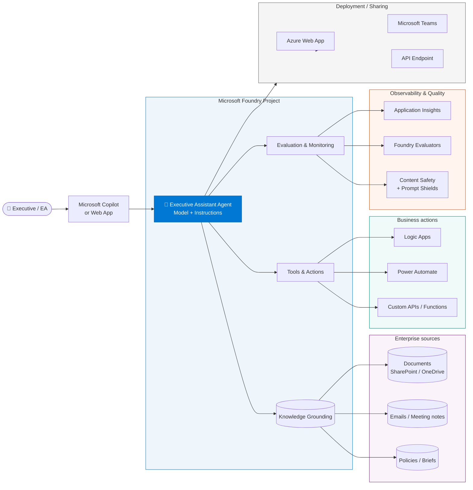
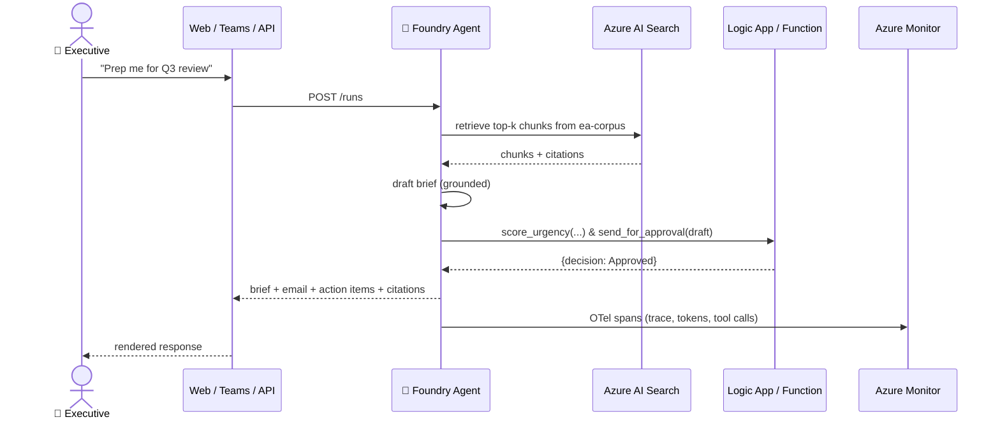

# Architecture Diagram

The Executive Assistant Agent is a **single agent** running inside **one Microsoft Foundry project** — with grounding, tools, evaluation, and deployment all wired through the same control plane.

## High-level architecture

## Component notes

### 🤖 Microsoft Foundry Agent (core)

- Model + instructions + orchestration logic.
- Same agent surfaces via all deployment channels (Web, Teams, API).
- Uses **Managed Identity** to call every downstream Azure service — no keys in code.

### 📚 Knowledge Grounding

- **Foundry IQ** on top of **Azure AI Search** — indexes meeting notes, briefs, policies, prior email threads.
- **File Search** — thread-scoped attachments (a PDF the executive drops in *right now*).
- Chunking: 1024 tokens / 100 overlap works well for exec-style prose.
- Every grounded answer must include a **citation** (enforced in instructions, measured by the Groundedness evaluator).

### 🔌 Tools & Actions

| Tool | Purpose | Backing service |
| --- | --- | --- |
| `create_tasks` | Create Planner / To-Do tasks after approval | Power Automate |
| `send_for_approval` | Email the executive a draft, get a decision back | Logic Apps |
| `propose_meeting_slots` | Return 3 candidate slots | Logic App / Graph |
| `score_urgency` | Compute urgency 0–100 | Azure Function (OpenAPI) |
| MCP tool *(optional)* | Connect an external system (CRM, ticketing) | MCP server + approval flow |

Rule of thumb: **prose belongs to the grounded model; verbs belong to tools**.

### 📊 Evaluation & Monitoring

- **Foundry Evaluators** — Task Adherence (≥ 4.25 = ~85% gate), Groundedness, Relevance, Coherence, plus the safety suite.
- **Content Safety + Prompt Shields** — categorical filters + jailbreak + indirect-prompt-injection detection.
- **Application Insights** — every agent run emits OpenTelemetry spans; the whole trace tree is visible in App Insights.

### 🚀 Deployment / Sharing

- **Web App** — Easy Auth (Entra ID) protects a demo URL.
- **Microsoft Teams** — Bot Service + a Teams manifest surfaces the agent in the app people already have open.
- **API endpoint** — for integration into Copilot Studio, custom UIs, or backend workflows.

## Design principles

1. **One Foundry project = one control plane.** Grounding, tools, guardrails, telemetry, RBAC all live there.
2. **The executive is always in the loop.** The agent drafts, scores, and prepares — the human sends and approves.
3. **Managed identity everywhere.** No keys, no service accounts, no drift.
4. **Measured before deployed.** Task adherence must ≥ 85%; safety defect rate must = 0 before shipping.
5. **Same agent, many surfaces.** The Web App, Teams App, and API endpoint all wrap the same underlying agent.

## Data flow (single request)

## When to change this architecture

- **You want more than one agent** → split into specialists and orchestrate with **Foundry Connected Agents** (e.g., Meeting-Notes agent → Email-Composer agent → Calendar agent). Same project, more agents.
- **You need strict tenant isolation** → move Foundry, Search, and Storage behind **private endpoints**; disable public network access.
- **You need custom evaluators** → author them alongside the built-ins in `evaluation/`.
- **You need multi-region** → deploy the Foundry account in a second region and point the Web App / Teams bot at a Traffic Manager or Front Door in front.
