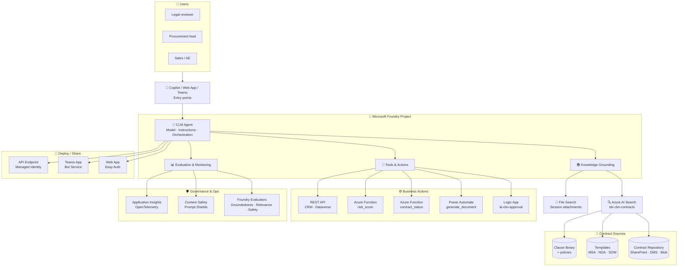
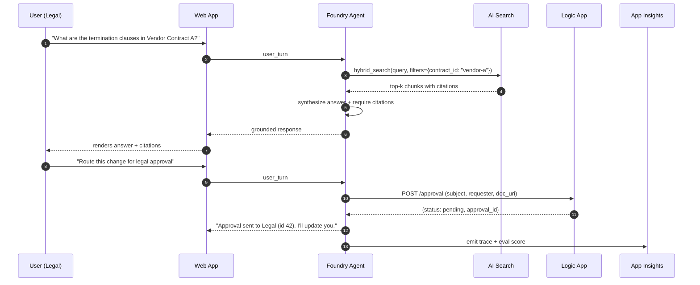

# Architecture — Contract Lifecycle Management Agent

This document describes the reference architecture for the **Contract Lifecycle Management (CLM) Agent** built on **Microsoft Foundry**. It shows how a contract question travels from a legal or procurement user to a grounded, tool-using, evaluated response.

## 🗺️ End-to-end architecture

## 🧩 Component notes

| Component | Purpose | Notes |
| --- | --- | --- |
| **Foundry Agent** | Orchestrator: routes a user turn to grounding + tools + eval. | `Model + Instructions + Tools`. Instructions define the contract-expert persona. |
| **Azure AI Search (`idx-clm-contracts`)** | Vector + hybrid retrieval over the contract repository. | `text-embedding-3-large`, chunk 1024 / overlap 100, `VECTOR_SEMANTIC_HYBRID`. |
| **File Search** | Session-scoped retrieval on user-attached contracts. | Great for one-off "review this contract" flows. |
| **Contract Repository** | SharePoint, DMS, Blob — the actual documents. | Indexed by the AI Search indexer; kept in sync. |
| **Logic App `la-clm-approval`** | HTTP-triggered approval routing to Legal / Procurement. | Office 365 approval email → response → returns decision to the agent. |
| **Power Automate `generate_document`** | Template-based document generation (NDA, SOW, amendment). | Fills templates using `{{party}}`, `{{effective_date}}`, `{{clauses}}`. |
| **Azure Function `contract_status`** | Reads / updates contract lifecycle state. | States: `Draft → In Review → Approved → Signed → Active → Expired`. |
| **Azure Function `risk_score`** | Deterministic 0–100 risk score based on missing / non-standard clauses. | Called by the agent when summarizing risks. |
| **CRM / Dataverse REST API** | Metadata about the counterparty and account. | Optional bonus tool for enrichment. |
| **Foundry Evaluators** | Groundedness, Relevance, Coherence, Task Adherence, Safety. | Gate: task adherence ≥ 4.25, groundedness ≥ 4.0, 0 injection defects. |
| **Content Safety / Prompt Shields** | Defense against jailbreaks and prompt injection in contract text. | Enabled globally at the project level. |
| **Application Insights** | Traces + evals via OpenTelemetry. | Dashboards for cost, latency, tool-call success, hallucination rate. |

## 🔁 Single-request flow

## 🧱 Design principles

1. **Grounding first, generation second.** The agent must not answer contract questions without a citation from the repository.
2. **Tools describe capability, not implementation.** Tool names + descriptions are the routing surface — write them for the model.
3. **Human in the loop for irreversible actions.** Approvals, doc generation, and status changes are proposed by the agent and confirmed by a human.
4. **Evaluated before shipped.** No promotion to Web / Teams / API without passing the evaluator gate.
5. **Observable by default.** OpenTelemetry to App Insights on day one — you cannot fix what you cannot see.

## 🔧 When to change this architecture

- **Contract volume > 100k documents:** partition the AI Search index by counterparty or contract type; add a router step.
- **Multi-language contracts:** add a translation step before indexing; keep original text in a separate field.
- **Regulated deployments:** add Purview labels and Customer-Managed Keys on Blob + Search; use Private Endpoints.
- **Multi-agent scenarios:** split into a **Retriever Agent** + **Drafting Agent** + **Approval Agent** with explicit handoff instructions.

---

Back to the [landing page](../landing-page.md) or jump straight to [Challenge 1 — Build the Agent](../docs/challenge-1-build-agent.md).
