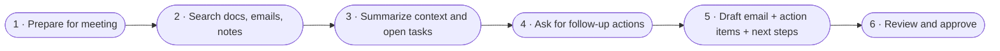
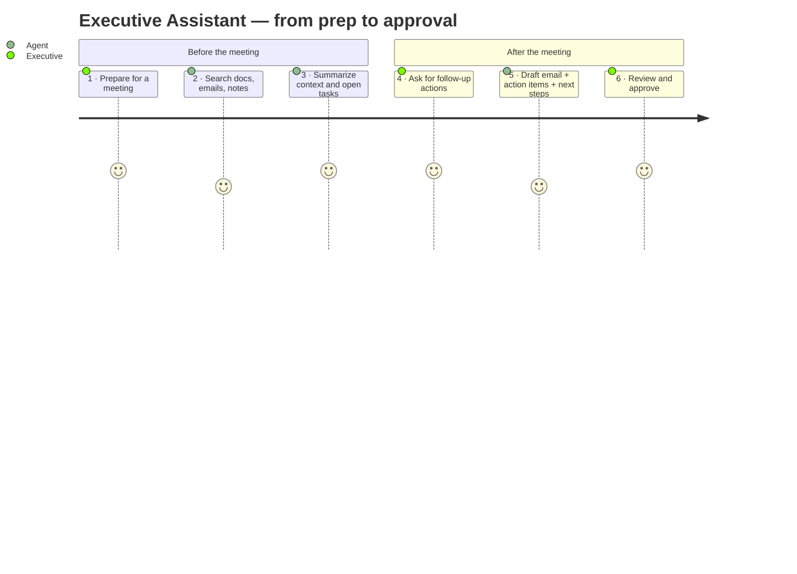

# User Journey — Executive Assistant Agent

> A six-step, real-world executive workflow. The Executive Assistant Agent supports the executive at every step and **always** ends with a human review.

## Overview



Alternate view — as a persona journey:



---

## Step-by-step narrative

### Step 1 — 🧑‍💼 Executive: *"Prepare me for a meeting"*

**Persona:** the executive (or her EA acting on her behalf).

**Prompt:**
```text
Prep me for tomorrow's 30-minute meeting with the CFO about Q3 forecast.
Attendees: me, CFO, Head of FP&A. Tone: professional, direct.
```

**What the agent does under the hood:** parses intent (meeting brief), extracts required inputs, asks *one* clarifying question if a critical input is missing (e.g. *"What primary decision do you want to walk out with?"*).

**Foundry capability:** Agent Service instructions from [Challenge 1](../docs/challenge-1-build-agent.md).

---

### Step 2 — 🤖 Agent: *Search enterprise sources*

Once inputs are clear, the agent hits **Foundry IQ** on **Azure AI Search** to pull top-k chunks from:

- Meeting notes (`meeting-notes-*.md`)
- Prior email threads (`email-thread-*.md`)
- Product / strategy briefs (`product-strategy-brief.md`)
- Policies (`travel-and-expenses-policy.md`)

If the user attached a fresh document to the thread, the agent also uses **File Search** to scope-search that file.

**Foundry capability:** Grounding + citations from [Challenge 2](../docs/challenge-2-grounding.md).

---

### Step 3 — 🤖 Agent: *Summarize key context and open tasks*

The agent returns a **Meeting brief** in the format enforced by its instructions:

```markdown
## Meeting brief — Q3 forecast review with CFO

**Attendees**: You, CFO (M. Johnson), Head of FP&A (P. Shah)
**Purpose**: Confirm Q3 outlook, sign off on marketing envelope, unblock pricing tooling budget.

**Key context**
- Q2 landed 3% ahead of plan [board-update-summary.md § Q2 recap]
- Marketing ask increased 15% mid-quarter [email-thread-marketing.md § Aug 12]
- Pricing tooling backlogged since June, blocking pricing-ops team [product-strategy-brief.md § Pricing tooling]

**Open questions**
- Do we commit €400k for pricing tooling now, or wait for Q4?
- What's the revised marketing envelope after the +15% ask?
- Are we still on track for the retail launch in October?

**Suggested talking points**
- Anchor on the Q2 beat before opening budget conversations.
- Bring the pricing-ops team's blocked-work data.
- Frame the retail decision as a Go / Delay / Cancel choice with dates.
```

Every factual claim carries a **citation** — that's the difference between a rumor and a brief.

---

### Step 4 — 🧑‍💼 Executive: *"Draft follow-up actions"*

The meeting happened. The executive comes back and asks:

```text
Meeting's done. Decisions:
- Cut marketing ask by 15%
- Approve €400k for pricing tooling
- Push retail launch decision to Oct 15

Give me action items with owners + due dates, score urgency of each, and
draft a follow-up email. If I approve, create the tasks.
```

**Foundry capability:** the same agent — no new session, same thread state.

---

### Step 5 — 🤖 Agent: *Create action items, draft email, suggest next steps*

The agent goes to work with tools from [Challenge 3](../docs/challenge-3-tools-actions.md):

1. Produce an **Action items** table:

   | # | Owner | Action | Due |
   |---|-------|--------|-----|
   | 1 | P. Shah (FP&A) | Reissue marketing budget at Q3-15% | Sep 20 |
   | 2 | J. Chen (Product) | Kick off €400k pricing-tooling project | Sep 18 |
   | 3 | M. Johnson (CFO) | Confirm retail launch Go/Delay/Cancel by Oct 15 | Oct 15 |

2. Call `score_urgency` for each row → adds a **band** column: `critical` / `high` / `normal`.

3. Draft a **follow-up email**:

   ```text
   Subject: Q3 forecast — decisions and next steps

   Team,

   Thanks for the crisp session today. Aligned outcomes:
   1. Marketing budget reissues at Q3-15%.
   2. €400k pricing-tooling project greenlit — J. Chen to kick off this week.
   3. Retail launch: Go/Delay/Cancel decision landing on Oct 15.

   I'll follow up individually where owners need context. Action items are
   attached — please confirm receipt.

   Best,
   ...
   ```

4. Call `send_for_approval` on that draft → the executive gets an approval email.

5. Once the executive clicks **Approve**, the agent calls `create_tasks` — the three action items land in Planner / To-Do.

Every step of steps 1–5 appears in the trace tree ([Challenge 4](../docs/challenge-4-evaluation.md) → Foundry Evaluators + App Insights).

---

### Step 6 — 🧑‍💼 Executive: *Review and approve*

The executive **always** has the final say. Two review surfaces:

- The **approval email** (Outlook) — one click to Approve / Reject.
- The **final rendered response** in the Web App / Teams — the executive sees the summary, the actions, the email, and the tasks that were created, before they're distributed to the team.

If the executive edits the draft in the UI, the agent updates the pending tasks and the outgoing email accordingly — nothing goes out until the human presses send.

---

## Example prompts you can copy-paste into the Playground

| Step | Prompt |
| --- | --- |
| 1 | `Prep me for a 30-min meeting with the CFO tomorrow about Q3 forecast. Attendees: me, CFO, Head of FP&A. Tone: professional, direct.` |
| 2 | `Search our internal notes and past emails for anything relevant to that meeting. Cite everything.` |
| 3 | `Summarize the top 3 open questions I should bring.` |
| 4 | `Meeting's done. Give me action items with owners + due dates from these decisions: [paste].` |
| 5 | `Score urgency of each item and draft a follow-up email. If I approve, create the tasks.` |
| 6 | *(Review the approval email, click Approve, verify the tasks landed.)* |

## Non-happy paths (worth trying)

| Scenario | Expected behavior |
| --- | --- |
| User uploads a doc with an embedded prompt injection | Prompt Shields flags it; agent treats content as **data**, not instructions. |
| Missing attendees | Agent asks *one* clarifying question. |
| Question out of corpus (e.g. crypto reimbursements) | Agent says the corpus does not cover it — does not guess. |
| User asks the agent to send an email without approval | Agent refuses and calls `send_for_approval` first. |
| Two conflicting sources in the corpus | Agent surfaces both and asks the executive which to trust. |

## Design principles the journey enforces

1. **Human always in the loop.** Every outbound step (email, task creation, workflow trigger) passes through the executive.
2. **Grounded first.** No claim is made without a citation.
3. **Tools do the doing.** The model drafts; tools act.
4. **Trace everything.** Every step becomes an OpenTelemetry span you can query in App Insights.
5. **Measure it.** The whole journey is part of the eval test set — this is exactly how you regression-test agents.
