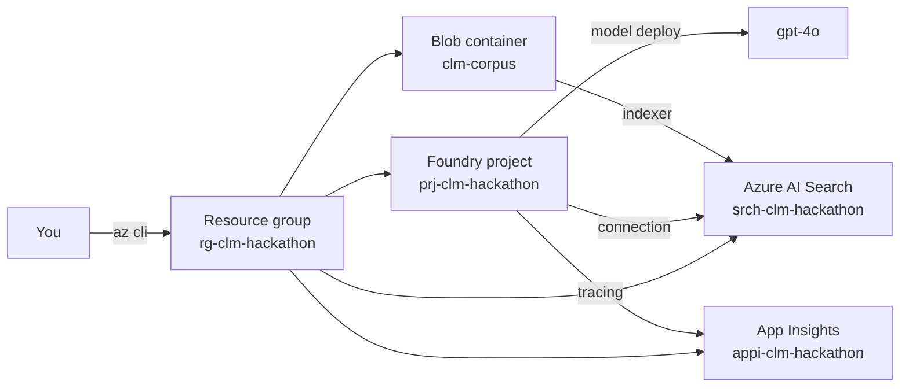

# Challenge 0 &middot; Setup

> **Duration:** ~45 minutes &middot; **Path:** Low-Code + Pro-Code &middot; **Next:** [Challenge 1 &mdash; Build Agent](./challenge-1-build-agent.md)

---

## 1. Context

Every downstream challenge assumes a working **Microsoft Foundry** project with a deployed model, a private search index over the contract corpus, tracing enabled, and the sample data uploaded. This challenge sets up all of that.

If your team has a shared Foundry hub already, you still create your own **project** inside it so each participant has their own agent, threads, and traces.

## 2. Objective

Provision the full environment needed to build the Contract Lifecycle Management Assistant:

- One Foundry project with a `gpt-4o` (or `gpt-4o-mini`) deployment.
- One Azure AI Search service + empty index `idx-clm-contracts`.
- Application Insights connected to the project (tracing on).
- Sample corpus (templates, clauses, policies) uploaded to Blob and indexed.
- A green smoke test from the SDK.

### Challenge map

- **Agent Capability:** Establish the baseline environment the agent depends on.
- **Tool Integration:** Prepare Search and tracing so later tool integrations work reliably.
- **Azure Services Used:** Microsoft Foundry, Azure OpenAI, Azure AI Search, Azure Blob Storage, Application Insights.
- **Expected Outcome:** A working project, indexed corpus, and green SDK smoke test.

## 3. Learning outcome

After Challenge 0 you can:

- Create a Foundry project and deploy a model.
- Connect Azure AI Search and Application Insights to a Foundry project.
- Upload a document corpus to Blob and index it into Azure AI Search.
- Run a Foundry SDK smoke test from your laptop.
- Explain which secret goes where (`AZURE_AI_PROJECT_CONNECTION_STRING`, `AZURE_SEARCH_ENDPOINT`, `APPLICATIONINSIGHTS_CONNECTION_STRING`).

## 4. Prerequisites

- An Azure subscription (Owner, or Contributor + User Access Administrator).
- Access to Microsoft Foundry at [`ai.azure.com`](https://ai.azure.com).
- Model quota for `gpt-4o` or `gpt-4o-mini` (&ge; 30k TPM recommended).
- Azure CLI: `az login && az account set --subscription <id>`.
- Python 3.11+ and `pip install -r ../requirements.txt`.

## 5. Architecture diagram



## 6. Low-code path

You will do everything in the Foundry portal + Azure portal.

## 7. Pro-code path

You will do everything from Azure CLI + `azure-ai-projects` SDK. Skip to [SDK walkthrough](#9-sdk-walkthrough) if you prefer the pro-code path.

## 8. Portal walkthrough

### 8.1 Create a resource group

Azure portal &rarr; **Resource groups** &rarr; **Create**.

- Name: `rg-clm-hackathon`
- Region: `eastus2` (or the region with `gpt-4o` quota)

### 8.2 Create a Foundry project

Go to [`ai.azure.com`](https://ai.azure.com) &rarr; **+ New project**.

- Project name: `prj-clm-<your-alias>`
- Hub: create a new one named `hub-clm-hackathon` in `rg-clm-hackathon` if you don't have one.
- Region: same as your resource group.

### 8.3 Deploy a model

Inside the project &rarr; **Models + endpoints** &rarr; **Deploy model** &rarr; **From base**.

- Model: `gpt-4o` (or `gpt-4o-mini`)
- Deployment name: `gpt-4o` (keep it simple &mdash; the SDK code references this name)
- Deployment type: **Standard**
- Tokens per minute: 30k

### 8.4 Create Azure AI Search

Azure portal &rarr; **Create a resource** &rarr; **Azure AI Search**.

- Name: `srch-clm-<your-alias>`
- Resource group: `rg-clm-hackathon`
- Tier: **Basic** (free tier does not support vector queries at scale)
- Enable **Semantic ranker** on the service (Settings &rarr; Semantic ranker &rarr; Free plan).

### 8.5 Create Application Insights

Azure portal &rarr; **Application Insights** &rarr; **Create**.

- Name: `appi-clm-hackathon`
- Workspace-based, in `rg-clm-hackathon`.
- Copy the **Connection string** &mdash; you will need it in `.env`.

### 8.6 Create Blob container and upload the corpus

- Storage account: `stclmhackathon<random>` (must be globally unique, lowercase, 3&ndash;24 chars).
- Container: `clm-corpus` (private).
- Upload the entire `data/` folder from this repo:

```powershell
az storage blob upload-batch `
  --account-name stclmhackathon<random> `
  --destination clm-corpus `
  --source ./data --pattern "*"
```

### 8.7 Add connections to the Foundry project

In the Foundry project &rarr; **Management center** &rarr; **Connected resources** &rarr; **+ New connection**.

- Add: your **Azure AI Search** service (`srch-clm-<your-alias>`).
- Add: your **Application Insights** (`appi-clm-hackathon`).
- Add: your **Storage account** (`stclmhackathon<random>`).

### 8.8 Enable tracing

In the project &rarr; **Tracing** &rarr; toggle **Enable tracing** &rarr; select `appi-clm-hackathon` as the target.

### 8.9 Grab your project connection string

Foundry project &rarr; **Overview** &rarr; **Project connection string** &rarr; **Copy**.

## 9. SDK walkthrough

You can automate steps 8.1&ndash;8.7 with the Azure CLI:

```powershell
$sub = "<subscription-id>"
$rg = "rg-clm-hackathon"
$loc = "eastus2"
$alias = "<your-alias>"

az account set --subscription $sub
az group create -n $rg -l $loc

# Storage + container
$st = "stclmhackathon$([System.Guid]::NewGuid().ToString('N').Substring(0,6))"
az storage account create -n $st -g $rg -l $loc --sku Standard_LRS
az storage container create --account-name $st -n clm-corpus --auth-mode login
az storage blob upload-batch --account-name $st -d clm-corpus -s ./data --pattern "*" --auth-mode login

# Search service (Basic + semantic ranker)
az search service create -n "srch-clm-$alias" -g $rg -l $loc --sku basic
az search service update -n "srch-clm-$alias" -g $rg --set semanticSearch=free

# App Insights (workspace-based)
$ws = "law-clm-hackathon"
az monitor log-analytics workspace create -g $rg -n $ws -l $loc
az monitor app-insights component create -g $rg -a appi-clm-hackathon -l $loc --workspace $ws
```

Then create the Foundry project and model deployment through the portal (steps 8.2&ndash;8.3) or via `az ml` / Bicep &mdash; whichever your subscription supports today.

Finally, copy the connection string values into `.env`:

```powershell
Copy-Item .env.example .env
notepad .env
```

Fill in:

```
AZURE_AI_PROJECT_CONNECTION_STRING=<from Foundry portal Overview>
AZURE_OPENAI_DEPLOYMENT=gpt-4o
AZURE_SEARCH_ENDPOINT=https://srch-clm-<your-alias>.search.windows.net
AZURE_SEARCH_INDEX=idx-clm-contracts
AZURE_SEARCH_API_KEY=<primary admin key>
APPLICATIONINSIGHTS_CONNECTION_STRING=<from App Insights>
```

## 10. Testing

Run the SDK smoke test:

```powershell
python -m app.sample_run --smoke
```

Expected output:

```
Connected to Foundry project.
Model deployment reachable: gpt-4o
Sample reply: 'foundry'
```

If any line fails, jump to [Validation](#11-validation) below to isolate the problem.

## 11. Validation

| Check | How to verify | Pass criteria |
| --- | --- | --- |
| Foundry project exists | Portal &rarr; Projects | `prj-clm-<your-alias>` is listed |
| Model deployed | Project &rarr; Models + endpoints | `gpt-4o` shows **Succeeded** |
| Search reachable | `az search service show -n srch-clm-<your-alias> -g rg-clm-hackathon` | `provisioningState: Succeeded` |
| Corpus uploaded | `az storage blob list --account-name <st> -c clm-corpus --auth-mode login --output table` | 10 files listed |
| App Insights connected | Foundry project &rarr; Tracing | Green **Enabled** badge |
| `.env` set | `python -c "from app.config import settings; print(settings.model_deployment)"` | Prints `gpt-4o` |
| Smoke test | `python -m app.sample_run --smoke` | Prints "Connected&hellip;", "Sample reply&hellip;" |

## 12. Success criteria

You have finished Challenge 0 when **all seven** validation rows above pass **and** the trace of your smoke test is visible in Application Insights (Project &rarr; **Tracing** &rarr; last 5 minutes).

## 13. Completion checklist

- [ ] Resource group `rg-clm-hackathon` created.
- [ ] Foundry project `prj-clm-<your-alias>` created.
- [ ] Model `gpt-4o` deployed with &ge; 30k TPM.
- [ ] Azure AI Search `srch-clm-<your-alias>` created with semantic ranker.
- [ ] Application Insights `appi-clm-hackathon` created, connection string copied.
- [ ] Blob container `clm-corpus` populated with the `data/` folder.
- [ ] Connections added in the Foundry project (Search, App Insights, Storage).
- [ ] Tracing enabled and pointed at `appi-clm-hackathon`.
- [ ] `.env` filled in with all six variables.
- [ ] `python -m app.sample_run --smoke` prints all three success lines.
- [ ] At least one trace is visible in App Insights.

## 14. Next challenge

Continue to [Challenge 1 &mdash; Build the Contract Intake &amp; Drafting Agent](./challenge-1-build-agent.md).
