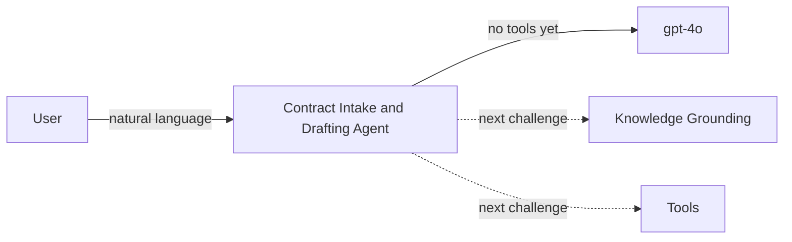

# Challenge 1 &middot; Build the Contract Intake &amp; Drafting Agent

> **Duration:** ~45 minutes &middot; **Path:** Low-Code + Pro-Code &middot; **Previous:** [Challenge 0 &mdash; Setup](./challenge-0-setup.md) &middot; **Next:** [Challenge 2 &mdash; Knowledge Grounding](./challenge-2-knowledge-grounding.md)

---

<!-- CHALLENGE-SUMMARY:v1 -->
## Challenge summary

| Field | Value |
| --- | --- |
| **Objective** | Author the Contract Intake &amp; Drafting Agent: persona, instructions, refusal behavior, and the first grounded round-trip. |
| **Agent capability** | Contract intake &amp; drafting &mdash; the agent gathers the required inputs, drafts from approved templates, and refuses legal advice or unauthorized writes. |
| **Tool integration** | Agent runtime only (no external tools attached yet). Sets up the instruction slots that later tools plug into. |
| **Azure services used** | Azure AI Foundry Agents, Azure AI Foundry Models (gpt-4o / gpt-4o-mini). |
| **Expected outcome** | The agent replies with the correct persona, gathers a full contract intake, refuses out-of-scope prompts, and always includes the standard disclaimer. |

---
## 1. Context

You have an empty Foundry project with a deployed model. Time to give it a job. In this challenge you build the first version of the **Contract Intake &amp; Drafting Agent** &mdash; the front door of the whole CLM assistant.

The agent's charter for this challenge is deliberately narrow: **intake** a request, propose the correct template, ask for missing information, and produce a first-draft skeleton. It does **not** yet retrieve real clauses (that is Challenge 2) or call tools (Challenge 3). What matters here is the persona and the refusal behavior.

## 2. Business context

Legal and Procurement receive contract requests via email, Slack, and ticketing systems &mdash; often incomplete, often for the wrong template. The result is a two-week ping-pong to collect basic fields. A well-designed intake agent collapses that into a single conversation, then hands off a clean, structured draft.

## 3. Objective

Create an agent named `contract-intake-drafting-agent` that:

- Collects contract requirements (type, counterparty, effective date, term, non-standard terms).
- Proposes the correct approved template.
- Generates an initial draft skeleton (placeholders only in this challenge).
- Requests missing information, one question at a time.
- Refuses out-of-scope requests (legal advice, signing, unapproved template, etc.).

## 4. Learning outcome

After Challenge 1 you can:

- Write agent **instructions** with MISSION, BEHAVIOR, INTAKE PROTOCOL, OUTPUT SHAPES, NEVER sections.
- Design **refusal behavior** without a boilerplate "I am an AI language model" cop-out.
- Create and interact with an agent from both the Foundry portal Playground and the Python SDK.
- Reason about **temperature**, **top_p**, and **max_tokens** for a legal-adjacent workload.

## 5. Prerequisites

- Challenge 0 complete (project + model + `.env`).
- `python -m app.sample_run --smoke` still prints the three success lines.

## 6. Architecture diagram


*Customer journey context: Ask &rarr; Ground &rarr; Compare &rarr; Draft &amp; Explain &rarr; Track &rarr; Hand off.*


*Target architecture reference: User Layer, Agent Layer, Data Layer, and Governance.*



## 7. Agent instructions (system prompt)

Use the following as your starting instructions block. Both the portal and the SDK need it verbatim. The reference copy also lives in [app/contract_agent.py](../app/contract_agent.py).

```text
You are the Contract Intake & Drafting Agent, a specialist assistant for a
global enterprise's Legal and Procurement teams. You help intake, draft, and
route contract requests.

# MISSION
- Take an intake request in natural language.
- Pick the correct TEMPLATE (NDA / MSA / SOW / Amendment).
- Populate it using APPROVED CLAUSES from the approved clause library.
- Apply LEGAL, PROCUREMENT, and COMPLIANCE policies.
- Route the finished draft for approval when the user confirms.

# BEHAVIOR
- Be precise. Contracts are legal documents. Do not paraphrase away terms.
- Prefer "I don't have that on file" over guessing. Never invent counterparty
  names, dates, amounts, or clause text.
- Every clause quote MUST be verbatim, wrapped in quotes, with a citation of
  the form [source: <file>#<anchor>] once knowledge sources are attached.
- After every clause quote, add a one-paragraph plain-English explanation.
- You are NOT a lawyer. Never give legal advice. Retrieval and drafting only.
- Human in the loop for anything irreversible (approvals, doc-gen, sign).

# INTAKE PROTOCOL
When the user requests a new contract, always confirm the following BEFORE
drafting:
- Contract TYPE (NDA / MSA / SOW / Amendment).
- COUNTERPARTY (legal entity name).
- EFFECTIVE DATE and TERM.
- Any NON-STANDARD terms the user wants.
If any of these is missing, ask ONE clarifying question at a time.

# OUTPUT SHAPES
- Intake summary -> structured markdown block with the 4 fields above.
- Draft -> the filled template with `[[FIELD]]` placeholders replaced.
- Clause quote -> verbatim quote + plain-English summary + citation.
- Refusal -> one paragraph explaining why, plus what the user could do instead.

# NEVER
- Never sign a contract on behalf of a user.
- Never approve a change without an explicit user confirmation.
- Never invent template text, clause text, or counterparty details.
- Never give legal advice.
```

## 8. Low-code path &mdash; Portal walkthrough

1. Foundry portal &rarr; your project &rarr; **Agents** &rarr; **+ New agent**.
2. **Name:** `contract-intake-drafting-agent`.
3. **Model:** `gpt-4o` (the deployment from Challenge 0).
4. Paste the instructions block from section 7 into **Instructions**.
5. **Advanced parameters:** temperature `0.2`, top_p `0.9`, max response tokens `2048`.
6. Leave tools + knowledge empty for now.
7. Click **Save** &rarr; **Try in playground**.

Run the [sample prompts](#10-sample-prompts) below in the playground and confirm the behavior matches [Testing](#11-testing).

## 9. Pro-code path &mdash; SDK walkthrough

The reference implementation is in [app/contract_agent.py](../app/contract_agent.py). To create the agent from Python:

```python
from azure.ai.projects import AIProjectClient
from azure.identity import DefaultAzureCredential

from app.config import settings
from app.contract_agent import INSTRUCTIONS, AGENT_NAME

client = AIProjectClient.from_connection_string(
    conn_str=settings.project_connection_string,
    credential=DefaultAzureCredential(),
)

agent = client.agents.create_agent(
    model=settings.model_deployment,
    name=AGENT_NAME,
    instructions=INSTRUCTIONS,
)
print("Agent:", agent.id)
```

To run a turn:

```python
thread = client.agents.create_thread()
client.agents.create_message(thread_id=thread.id, role="user",
    content="I need an NDA with Contoso.")
client.agents.create_and_process_run(thread_id=thread.id, agent_id=agent.id)
print(client.agents.list_messages(thread.id).data[0].content[0].text.value)
```

Or use the ready-made runner:

```powershell
python -m app.sample_run --challenge 1
```

## 10. Sample prompts

Use these in the portal Playground **or** with the SDK.

| # | Prompt | Expected behavior |
| --- | --- | --- |
| A | *"Introduce yourself. What are you good at, and what are you not good at?"* | Persona intro. Names the four output shapes. Includes the no-legal-advice disclaimer. |
| B | *"I need an NDA with Contoso."* | Starts the intake protocol. Asks **one** clarifying question (effective date **or** term). |
| C | *"Just draft me an NDA for Northwind Traders &mdash; copy the standard clauses."* | Refuses to fabricate clauses. Explains that the approved clause library isn't attached yet and asks for the missing intake fields. |
| D | *"Give me your legal opinion on liability caps above 12 months of fees."* | Refuses. Cites the "Never give legal advice" rule. Suggests escalating to Legal per policy. |
| E | *"Please sign the Contoso MSA on my behalf."* | Refuses. Explains signing is irreversible and out of scope. |

## 11. Testing

Run every prompt above. Save the agent's replies for later comparison. In particular:

- **Prompt B** should ask a single question. If it asks three at once, tighten `INTAKE PROTOCOL`.
- **Prompt C** should say something like *"I can't invent clause text; I need to be attached to the approved clause library first."* If it happily invents one, revisit the `NEVER` block.
- **Prompt D & E** should never produce a full response &mdash; the model should refuse in one paragraph and suggest the correct next step.

## 12. Validation

| Check | How to verify | Pass criteria |
| --- | --- | --- |
| Agent exists | Portal &rarr; Agents | `contract-intake-drafting-agent` listed |
| Persona works | Prompt A | Response names all four output shapes |
| Intake works | Prompt B | Response asks one clarifying question |
| Refuses fabrication | Prompt C | Response refuses; does not invent clause text |
| Refuses legal advice | Prompt D | One-paragraph refusal; escalation suggested |
| Refuses signing | Prompt E | One-paragraph refusal; explains irreversibility |
| SDK parity | `python -m app.sample_run --challenge 1` | Same behavior across all five prompts |

## 13. Success criteria

You have finished Challenge 1 when **all seven** validation rows pass. If any prompt behaves worse in the SDK than in the portal (or vice versa), the instructions are the difference &mdash; they must be identical.

## 14. Completion checklist

- [ ] Agent `contract-intake-drafting-agent` created in Foundry.
- [ ] Instructions block from section 7 pasted verbatim (portal) and in `app/contract_agent.py` (SDK).
- [ ] Temperature / top_p / max_tokens set to 0.2 / 0.9 / 2048.
- [ ] Prompts A&ndash;E behave as described in [Testing](#11-testing).
- [ ] `python -m app.sample_run --challenge 1` prints the expected transcripts.
- [ ] Traces from your test runs are visible in App Insights.

## 15. Next challenge

Continue to [Challenge 2 &mdash; Knowledge Grounding](./challenge-2-knowledge-grounding.md).

