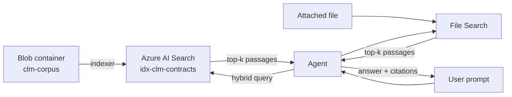

# Challenge 2 · Knowledge Grounding

> **Duration:** ~60 minutes · **Path:** Low-Code + Pro-Code · **Previous:** [Challenge 1](./challenge-1-build-agent.md) · **Next:** [Challenge 3 — Tools & Actions](./challenge-3-tools-actions.md)

---

<!-- CHALLENGE-SUMMARY:v1 -->
## Challenge summary

| Field | Value |
| --- | --- |
| **Objective** | Ground the agent on the enterprise contract corpus (templates, clauses, policies) with citations on every answer. |
| **Agent capability** | Contract search &amp; review &mdash; the agent retrieves from Azure AI Search and cites the exact document, clause, or paragraph. |
| **Tool integration** | **Foundry IQ** (Azure AI Search) attached &mdash; the internal knowledge tool. SharePoint access via Foundry IQ is enabled in Challenge 3. |
| **Azure services used** | Azure AI Search (hybrid vector + semantic), Azure Blob Storage, Azure AI Foundry Models (embeddings). |
| **Expected outcome** | Every corpus answer includes a traceable citation. Fabricated content is refused and re-grounded. |

---
## 1. Context

Your agent is fluent but ignorant. Ask it to quote your standard payment-terms clause and it will happily invent one. In this challenge you attach **enterprise knowledge**: templates, approved clauses, policies, and historical contracts &mdash; indexed in **Azure AI Search** &mdash; plus a **File Search** channel for documents users attach mid-conversation.

## 2. Business context

Legal spends 35% of its time answering "what does clause X in contract Y say?". The corpus is real, mostly text-heavy, and rarely changes. That is the sweet spot for retrieval: cheap to index, high precision when queried, and every answer comes with a citation the reviewer can double-click.

## 3. Objective

Ground the Contract Intake &amp; Drafting Agent so that:

- It retrieves passages from `idx-clm-contracts` before answering factual questions.
- It quotes clauses verbatim with a citation like `[source: approved_clauses/payment_terms.md#CLS-PAY-STD-2026.07]`.
- Users can attach a PDF to a thread and get comparative answers via **File Search**.
- If the top-k passages don't contain the answer, it says so.

## 4. Learning outcome

After Challenge 2 you can:

- Explain why retrieval-augmented generation reduces hallucination and how vector + semantic hybrid search works.
- Ingest markdown/PDF/DOCX into Azure Blob and index it into Azure AI Search with the right chunking strategy.
- Attach `AzureAISearchTool` and `FileSearchTool` to a Foundry agent.
- Write retrieval rules in the system prompt that reliably produce citations.

## 5. Prerequisites

- Challenge 0 complete (Search service, Blob container).
- Challenge 1 complete (agent exists).
- Sample corpus already in `data/` (10 files) and uploaded to `clm-corpus`.

## 6. Architecture diagram


*Customer journey context: Ask &rarr; Ground &rarr; Compare &rarr; Draft &amp; Explain &rarr; Track &rarr; Hand off.*


*Target architecture reference: User Layer, Agent Layer, Data Layer, and Governance.*



## 7. Knowledge sources you will index

| Source folder | What it is | Why it matters |
| --- | --- | --- |
| `data/contract_templates/` | NDA, MSA, SOW templates | Base for every new draft |
| `data/approved_clauses/` | Payment, liability, termination | Verbatim clause insertion |
| `data/policies/` | Legal, procurement, compliance | Enforce policy in draft responses |
| `data/test_cases/` *(not indexed)* | Evaluation dataset | Used in Challenge 6 |

## 8. Chunking &amp; index strategy

| Setting | Value | Why |
| --- | --- | --- |
| Chunk size | **1024 tokens** | Preserves entire clauses in a single chunk |
| Chunk overlap | **100 tokens** | Avoids clause splits at boundaries |
| Vector model | `text-embedding-3-large` | Best price/quality for legal English |
| Retrieval mode | **VECTOR_SEMANTIC_HYBRID** | Combines BM25 recall with vector precision |
| Semantic ranker | **Enabled** | Reranks top 50 into a well-ordered top-k |
| Top-k | **5** | Enough context, low token spend |

## 9. Low-code path &mdash; Portal walkthrough

### 9.1 Import + vectorize the corpus

Azure portal &rarr; your Search service &rarr; **Import and vectorize data**.

1. **Data source:** Azure Blob Storage &rarr; select `stclmhackathon<random>` &rarr; container `clm-corpus`.
2. **Vectorize your text:** use the connection to your Azure OpenAI deployment; embedding model `text-embedding-3-large`.
3. **Advanced settings:** chunk size `1024`, overlap `100`.
4. **Index name:** `idx-clm-contracts`.
5. **Run indexer now:** Yes.

Wait ~2 minutes for the indexer to finish. Then hit **Search explorer** and try `payment terms` &mdash; you should see chunks from `payment_terms.md`.

### 9.2 Attach knowledge to the agent

Foundry portal &rarr; **Agents** &rarr; `contract-intake-drafting-agent` &rarr; **Knowledge**.

- **+ Add knowledge** &rarr; **Azure AI Search** &rarr; pick the `srch-clm-<your-alias>` connection &rarr; index `idx-clm-contracts` &rarr; **top-k = 5**.
- **+ Add knowledge** &rarr; **File Search** &rarr; leave empty (users attach files at run time).

### 9.3 Append retrieval rules to the instructions

Open the agent instructions and append the following block after the existing NEVER section:

```text
# KNOWLEDGE
You have TWO grounding sources:
1. AzureAISearchTool -> index `idx-clm-contracts` — the enterprise
   corpus of templates, approved clauses, and policies.
2. FileSearch — for documents attached by the user in this session.

# RETRIEVAL RULES
- Always ground factual claims about a template / clause / policy in a
  retrieved passage. Every clause quote MUST include an inline citation of
  the form [source: <file>#<anchor>].
- If the top-k results don't contain the answer, say so plainly.
- Prefer the APPROVED CLAUSE from the library over writing new clause text.
- Prefer FileSearch results over the repository when the user has attached
  a specific file to the thread.

# DRAFTING RULE
When drafting a contract:
- Start from a TEMPLATE (NDA / MSA / SOW).
- Fill placeholders (`[[COUNTERPARTY]]`, `[[EFFECTIVE_DATE]]`, `[[TERM]]`, ...).
- For each variable clause (payment / liability / termination), retrieve the
  APPROVED CLAUSE and insert it verbatim with a citation.
- If the user requests a NON-STANDARD term, flag it in a "Non-standard"
  section at the top of the draft and cite the applicable policy.
```

Save the agent.

## 10. Pro-code path &mdash; SDK walkthrough

### 10.1 Create the index programmatically

```python
from azure.search.documents.indexes import SearchIndexClient
from azure.search.documents.indexes.models import (
    SearchIndex, SearchField, SearchFieldDataType,
    VectorSearch, VectorSearchProfile, HnswAlgorithmConfiguration,
    SemanticConfiguration, SemanticField, SemanticPrioritizedFields, SemanticSearch,
)
from azure.identity import DefaultAzureCredential

client = SearchIndexClient(endpoint="<AZURE_SEARCH_ENDPOINT>",
                           credential=DefaultAzureCredential())

index = SearchIndex(
    name="idx-clm-contracts",
    fields=[
        SearchField(name="id", type=SearchFieldDataType.String, key=True),
        SearchField(name="content", type=SearchFieldDataType.String, searchable=True),
        SearchField(name="filepath", type=SearchFieldDataType.String, filterable=True),
        SearchField(name="anchor", type=SearchFieldDataType.String, filterable=True),
        SearchField(name="content_vector",
                    type=SearchFieldDataType.Collection(SearchFieldDataType.Single),
                    searchable=True, vector_search_dimensions=3072,
                    vector_search_profile_name="hnsw-profile"),
    ],
    vector_search=VectorSearch(
        profiles=[VectorSearchProfile(name="hnsw-profile", algorithm_configuration_name="hnsw")],
        algorithms=[HnswAlgorithmConfiguration(name="hnsw")],
    ),
    semantic_search=SemanticSearch(configurations=[
        SemanticConfiguration(
            name="default",
            prioritized_fields=SemanticPrioritizedFields(
                content_fields=[SemanticField(field_name="content")],
                keywords_fields=[SemanticField(field_name="filepath")],
            ),
        )
    ]),
)
client.create_or_update_index(index)
```

### 10.2 Attach grounding to the agent

The reference is in [app/grounding.py](../app/grounding.py):

```python
from app.grounding import attach_grounding

# The connection id lives in the Foundry project -> Connections page.
attach_grounding(search_connection_id="<connection-id>")
```

### 10.3 Test a grounded turn

```powershell
python -m app.sample_run --challenge 2
```

## 11. Sample prompts

| # | Prompt | Expected behavior |
| --- | --- | --- |
| A | *"Draft a mutual NDA with Contoso, effective 2026-08-01, 2-year term."* | Fills the template; quotes payment/liability/termination clauses verbatim; each with a `[source: ...]` citation. |
| B | *"What does our procurement policy say about payment terms shorter than net-30?"* | Cites `data/policies/procurement_guidelines.md` section 3. |
| C | *"Draft me a construction subcontract for Fabrikam."* | Says the corpus does not include a construction template. Offers MSA + SOW alternative. |
| D | Attach a counterparty NDA PDF, then: *"Compare the liability clause in the attached PDF against our approved liability clause."* | Uses File Search + AI Search; produces a side-by-side quote with citations from both. |

## 12. Testing

- Run every prompt in the portal Playground, then repeat via the SDK. Same outputs, minus timing.
- Turn `top-k` down to `1` and rerun Prompt A. Watch quality drop &mdash; that's your intuition for retrieval budget.
- Delete one policy from `clm-corpus` and re-run the indexer. Ask Prompt B again &mdash; the agent should say the policy is not in the corpus, not invent one.

## 13. Validation

| Check | How to verify | Pass criteria |
| --- | --- | --- |
| Index exists | Portal &rarr; Search &rarr; Indexes | `idx-clm-contracts` with document count &ge; 30 |
| Vectorization worked | Search explorer &rarr; query `"liability cap"` | Top result is `liability_clause.md` |
| Agent attached | Portal &rarr; Agent &rarr; Knowledge | AzureAISearchTool + FileSearchTool listed |
| Citations present | Prompt A | Every clause quote has `[source: ...]` |
| Grounded refusal | Prompt C | Refuses; does not invent construction template |
| File Search works | Prompt D | Agent references both sources |
| SDK parity | `python -m app.sample_run --challenge 2` | Same outputs as portal |

## 14. Success criteria

You have finished Challenge 2 when the agent **never** produces an ungrounded clause quote &mdash; and correctly says "not in the corpus" for questions it cannot answer.

## 15. Completion checklist

- [ ] `idx-clm-contracts` created and populated (&ge; 30 chunks).
- [ ] Semantic ranker enabled on the Search service.
- [ ] `AzureAISearchTool` (top-k 5) attached to the agent.
- [ ] `FileSearchTool` attached to the agent.
- [ ] KNOWLEDGE + RETRIEVAL RULES + DRAFTING RULE blocks appended to instructions.
- [ ] Sample prompts A&ndash;D behave as described in [Testing](#12-testing).
- [ ] Every clause response includes a `[source: ...]` citation.

## 16. Next challenge

Continue to [Challenge 3 &mdash; Tools &amp; Actions](./challenge-3-tools-actions.md).

