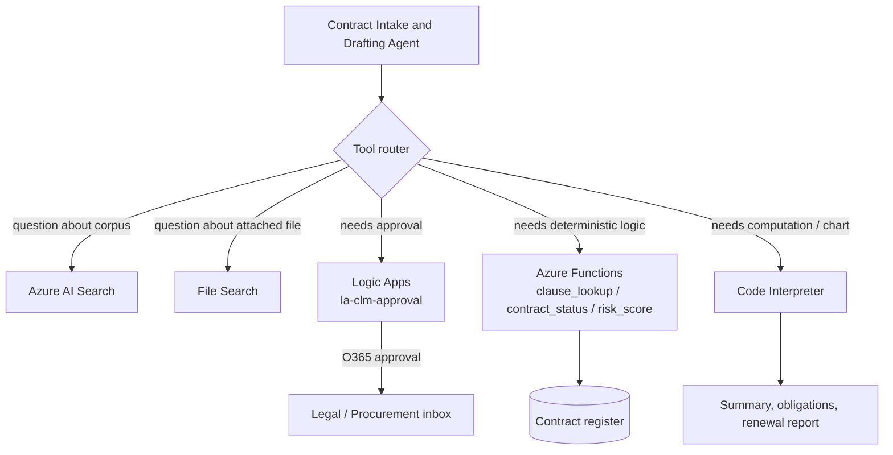

# Challenge 3 &middot; Tools &amp; Actions

> **Duration:** ~75 minutes &middot; **Path:** Low-Code + Pro-Code &middot; **Previous:** [Challenge 2](./challenge-2-knowledge-grounding.md) &middot; **Next:** [Challenge 4 &mdash; Guardrails](./challenge-4-guardrails.md)

---

## 1. Context

An agent that can only read is a chatbot. In this challenge you turn the CLM assistant into a real **enterprise agent** by giving it five tools that touch business systems: search, file search, workflow, functions, and code interpretation.

Every tool needs a clear reason to exist. The agent doesn't get to pick tools it doesn't need &mdash; the more tools, the more misrouting risk.

## 2. Business context

The real workday of a Legal or Procurement analyst is stitched together across search, email, approval routing, and spreadsheet math. This challenge wires each of those into a single conversation.

## 3. Objective

Extend the agent with five tools: Azure AI Search, File Search, Power Automate, Azure Functions, and Code Interpreter.

| # | Tool | Purpose | Business value |
| --- | --- | --- | --- |
| 1 | **Azure AI Search** | Find contracts, search clauses, retrieve similar agreements | Cuts "where does it live?" from days to seconds |
| 2 | **File Search** | Search uploaded PDFs, Word docs, and inline threads | Users can drop a counterparty draft and get a compare-and-contrast |
| 3 | **Power Automate** | Approval routing, email notifications, renewals, escalations | Removes email ping-pong; every approval is auditable |
| 4 | **Azure Functions** | Deterministic clause lookup, contract status, and document generation | Testable business logic tied to systems of record |
| 5 | **Code Interpreter** | Contract summaries, obligation analysis, risk reports, renewal reports | On-the-fly analytics without a BI project |

### Challenge map

- **Agent Capability:** Route user requests to the right tool with confirmation for irreversible actions.
- **Tool Integration:** Azure AI Search, File Search, Power Automate approval routing, Azure Functions, Code Interpreter.
- **Azure Services Used:** Microsoft Foundry Agent tools, Azure AI Search, Power Automate, Azure Functions, Dataverse/SQL.
- **Expected Outcome:** End-to-end tool orchestration in one thread with auditable actions and deterministic state updates.

## 4. Learning outcome

After Challenge 3 you can:

- Design a small, orthogonal tool set the agent can route to reliably.
- Register Foundry tools of three shapes: **built-in** (Search, File Search, Code Interpreter), **HTTP** (Power Automate), and **function** (Azure Functions).
- Write a TOOL ROUTING block that stops the agent from firing the wrong tool.
- Confirm irreversible actions with the user before firing them.

## 5. Prerequisites

- Challenge 2 complete (agent, index, File Search all working).
- Azure Functions Core Tools installed (`func --version`) &mdash; for the pro-code path.
- A Microsoft 365 tenant with Power Automate approvals, **or** a mocked HTTP endpoint you can hit for approvals.

## 6. Architecture diagram



## 7. Tool 1 &mdash; Azure AI Search

### Purpose
Find contracts, clauses, and policies in the enterprise corpus.

### Business value
Answers "what does clause X say in contract Y?" in seconds, with citations.

### Configuration
Already attached in Challenge 2. Confirm: agent &rarr; **Tools** &rarr; **AzureAISearchTool**, top-k `5`.

### Sample prompts
- *"Find every contract with Contoso from 2025."*
- *"What is our standard liability cap?"*

## 8. Tool 2 &mdash; File Search

### Purpose
Search inside PDFs, Word docs, and files attached to the thread.

### Business value
Reviewer drops a counterparty draft in chat and the agent can quote/compare without a re-index.

### Configuration
Attached in Challenge 2. Confirm: agent &rarr; **Tools** &rarr; **FileSearchTool**.

### Sample prompts
- Attach a PDF, then: *"What is the notice period in this contract?"*
- *"Compare the liability clause in the attached PDF to our approved liability clause."*

## 9. Tool 3 &mdash; Power Automate (Approval Routing)

### Purpose
Route contract drafts to the correct approver for sign-off. Send renewal reminders. Escalate stale approvals.

### Business value
Every AI-suggested contract action produces an auditable approval trail.

### Low-code setup (portal)

Power Automate portal &rarr; create a **cloud flow** with trigger **When an HTTP request is received** named `pa-clm-approval`.

1. Trigger: **When an HTTP request is received**. Request body JSON schema:

   ```json
   {
     "type": "object",
     "properties": {
       "subject":      { "type": "string" },
       "requester":    { "type": "string" },
       "counterparty": { "type": "string" },
       "doc_uri":      { "type": "string" },
       "risk_band":    { "type": "string" }
     }
   }
   ```

2. Action: **Office 365 Outlook &mdash; Send approval email** to `legal-approvers@<your-tenant>`. Body includes `subject`, `counterparty`, `doc_uri`.
3. Action: **Response** &rarr; `200 OK` with body:

   ```json
   { "approval_id": "@{workflow().run.name}", "status": "pending" }
   ```

4. Save. Copy the **HTTP POST URL** and put it in `.env` as `LOGIC_APP_APPROVAL_URL`.

### Pro-code setup

The Python wrapper is [app/tools.py `route_approval()`](../app/tools.py). It POSTs the JSON above to `LOGIC_APP_APPROVAL_URL`. If the env var is empty, it returns a stub response so you can develop offline.

### Register with the agent

In the portal &rarr; agent &rarr; **Tools** &rarr; **+ Add tool** &rarr; **OpenAPI / Function** &rarr; upload an OpenAPI JSON file for the Power Automate HTTP trigger. Give it name `route_approval`.

### Sample prompt
- *"Route the Contoso NDA for legal approval."* &rarr; agent should ask for confirmation, then fire `route_approval`.

## 10. Tool 4 &mdash; Azure Functions

### Purpose
Deterministic business logic the LLM should not bluff: approved clause lookup, contract status transitions, and document generation.

### Business value
Uses a system of record instead of the model's opinion. Fully testable, versioned, and auditable.

### Functions to deploy

| Function | Route | Input | Output |
| --- | --- | --- | --- |
| `clause_lookup` | `POST /api/clause_lookup` | `{ category: "payment"|"liability"|"termination" }` | `{ clause, version, source }` |
| `contract_status` | `POST /api/contract_status` | `{ contract_id, new_state? }` | `{ contract_id, state, updated_at }` |
| `document_generation` | `POST /api/document_generation` | `{ template, counterparty, effective_date, term, clauses[] }` | `{ doc_uri, template, generated_at }` |

The Python reference lives in [app/tools.py](../app/tools.py). Deploy skeleton:

```powershell
func init clm-func --python
cd clm-func
func new --name clause_lookup --template "HTTP trigger" --authlevel "function"
# paste the body from app/tools.py `clause_lookup`
func azure functionapp publish func-clm-<your-alias>
```

Copy `FUNCTION_APP_ENDPOINT` (e.g. `https://func-clm-<your-alias>.azurewebsites.net`) into `.env`.

### Register with the agent

Portal &rarr; agent &rarr; **Tools** &rarr; **+ Add tool** &rarr; **Function** &rarr; paste the JSON schema for each function. Suggested names: `clause_lookup`, `contract_status`, `document_generation`.

### Sample prompts
- *"Look up our approved liability clause."* &rarr; `clause_lookup(category="liability")`.
- *"What state is contract CON-2024-0417?"* &rarr; `contract_status(contract_id="CON-2024-0417")`.
- *"Generate the first NDA draft for Contoso using approved clauses."* &rarr; `document_generation(template="NDA", ...)`.

## 11. Tool 5 &mdash; Code Interpreter

### Purpose
On-the-fly Python for summaries, obligation extraction, renewal reports, ad-hoc math.

### Business value
Skip the "let me open Excel" detour. The agent can chart auto-renewals over the next 90 days in-conversation.

### Configuration

Portal &rarr; agent &rarr; **Tools** &rarr; **+ Add tool** &rarr; **Code Interpreter**. That's it &mdash; Foundry runs it in a sandbox.

### Sample prompts
- *"Summarize this MSA in 5 bullet points, and list every obligation on us."*
- *"Give me a table of every contract expiring in the next 90 days."* (Feed it a CSV of contract IDs and end dates.)

## 12. TOOL ROUTING block (append to instructions)

Append this to your agent instructions after DRAFTING RULE:

```text
# TOOL ROUTING
- Retrieval about a template, clause, policy, or historical contract -> AzureAISearchTool.
- Question about a file attached in this thread -> FileSearchTool.
- User wants a specific approved clause quoted -> clause_lookup(category).
- User asks about a contract's lifecycle state, or wants to change it -> contract_status(contract_id, new_state?). Ask before changing state.
- User wants a deterministic draft artifact from approved inputs -> document_generation(template, counterparty, effective_date, term, clauses).
- User asks to route for approval / sign-off / legal review -> route_approval(...).
  Always confirm the payload with the user in one sentence before firing.
- User wants a summary, obligations table, or a chart -> Code Interpreter.
```

## 13. Pro-code path &mdash; SDK walkthrough

Reference: [app/tools.py](../app/tools.py) exposes each tool as a Python function.

```python
from azure.ai.projects.models import FunctionTool, CodeInterpreterTool
from app.contract_agent import client, get_agent
from app import tools

functions = FunctionTool(functions={
    tools.clause_lookup,
    tools.contract_status,
    tools.generate_document,
})
code = CodeInterpreterTool()

agent = get_agent()
client.agents.update_agent(
    agent_id=agent.id,
    tools=[*functions.definitions, *code.definitions],
    tool_resources=code.resources,
)
```

The dispatch loop that maps function-tool calls back into `tools.py` is built into `create_and_process_run` when you register `FunctionTool` &mdash; no extra glue required.

## 14. End-to-end scenario

Run this scenario in one thread. Every step should feel like a single conversation.

1. *"I need a mutual NDA with Contoso, effective 2026-08-01, 2-year term."* &rarr; intake protocol.
2. *"Use our standard liability clause."* &rarr; `clause_lookup(category="liability")`.
3. *"Fill the template and route for legal approval."* &rarr; draft, then agent asks: *"I will route this to legal-approvers@... with risk band Medium. Confirm?"* &rarr; on yes, `route_approval(...)`.
4. *"Mark the NDA as In Review."* &rarr; `contract_status(new_state="In Review")` (asks for confirmation first).
5. *"Summarize the draft in 5 bullet points."* &rarr; Code Interpreter.

## 15. Testing

Verify in App Insights that each turn produced a `gen_ai.tool.call` event with the expected tool name. Bad routing (fires `route_approval` for a summary request, for example) means TOOL ROUTING needs to be more specific.

## 16. Validation

| Check | How to verify | Pass criteria |
| --- | --- | --- |
| All five tools registered | Portal &rarr; agent &rarr; Tools | Search, File Search, `route_approval`, `clause_lookup`, `contract_status`, `document_generation`, Code Interpreter |
| Search tool | *"Find every contract with Contoso"* | Cites real corpus docs |
| Function tool | *"Look up our approved liability clause."* | `clause_lookup` invoked with `category="liability"` |
| Power Automate tool | *"Route the Contoso NDA for approval."* | Agent confirms, then `route_approval` returns approval id |
| Code Interpreter | *"Summarize in 5 bullets."* | Runs Python; returns bullets |
| Confirmation | *"Mark the Contoso NDA as Signed."* | Agent asks to confirm before firing |
| SDK parity | `python -m app.sample_run --challenge 3` | Same behavior end-to-end |

## 17. Success criteria

The end-to-end scenario in [section 14](#14-end-to-end-scenario) completes in one thread, produces the right tool calls in the right order, and the trace in App Insights shows every step.

## 18. Completion checklist

- [ ] Power Automate flow `pa-clm-approval` deployed; approval URL set in `.env`.
- [ ] Function App with `clause_lookup`, `contract_status`, `document_generation` deployed; `FUNCTION_APP_ENDPOINT` in `.env`.
- [ ] Five tools registered on the agent (Search, File Search, `route_approval`, functions x3, Code Interpreter).
- [ ] TOOL ROUTING block appended to instructions.
- [ ] End-to-end scenario runs in a single thread.
- [ ] App Insights shows each `gen_ai.tool.call` event.
- [ ] Agent asks to confirm before any irreversible action.

## 19. Next challenge

Continue to [Challenge 4 &mdash; Guardrails](./challenge-4-guardrails.md).
