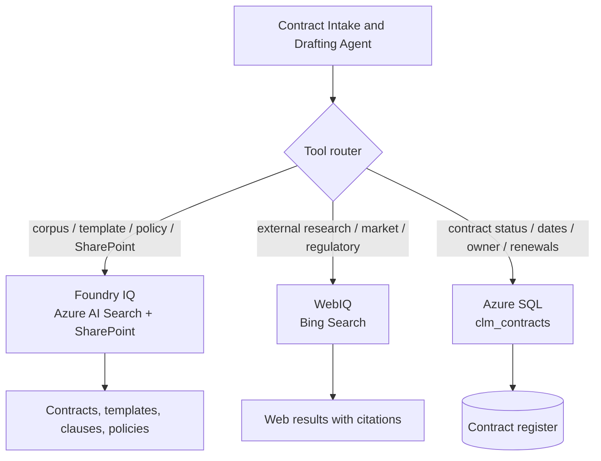

# Challenge 3 &middot; Tools &amp; Actions

> **Duration:** ~75 minutes &middot; **Path:** Low-Code + Pro-Code &middot; **Previous:** [Challenge 2](./challenge-2-knowledge-grounding.md) &middot; **Next:** [Challenge 4 &mdash; Guardrails](./challenge-4-guardrails.md)

---

<!-- CHALLENGE-SUMMARY:v1 -->
## Challenge summary

| Field | Value |
| --- | --- |
| **Objective** | Attach the three canonical Contract Lifecycle Management tools to the agent and prove end-to-end orchestration. |
| **Agent capability** | Full CLM workflow &mdash; internal search &amp; grounding, external research, and structured contract-data lookup in one conversation. |
| **Tool integration** | **Foundry IQ** (Azure AI Search + SharePoint) &middot; **WebIQ** (Bing Search) &middot; **Azure SQL** (structured contract data). |
| **Azure services used** | Azure AI Foundry, Foundry IQ, Azure AI Search, SharePoint, Bing Search, Azure SQL. |
| **Expected outcome** | The agent runs the scripted scenario in a single thread, pulls internal knowledge, enriches with external research, reads structured contract data, and every tool call is visible in App Insights. |

---
## 1. Context

An agent that can only read is a chatbot. In this challenge you turn the CLM assistant into a real **enterprise agent** by giving it the three tools that cover the full Contract Lifecycle Management workflow: **Foundry IQ**, **WebIQ**, and **Azure SQL**.

Every tool needs a clear reason to exist. The agent doesn't get to pick tools it doesn't need &mdash; the more tools, the more misrouting risk.

## 2. Business context

The real workday of a Legal or Procurement analyst is stitched together across corpus lookups, external research on counterparties or regulations, and quick pulls of a contract's current lifecycle state. This challenge wires each of those into a single conversation.

## 3. Objective

Register the three canonical Contract Lifecycle Management tools with the Contract Intake &amp; Drafting Agent, teach it when to use each, and prove it end-to-end with a scripted scenario.

| # | Tool | Connected service(s) | Purpose | Expected outcome |
| --- | --- | --- | --- | --- |
| 1 | **Foundry IQ** | Azure AI Search &middot; SharePoint | Contract search, document grounding, and knowledge retrieval &mdash; hybrid vector + semantic across the corpus, plus native SharePoint access to templates, executed contracts, and policies | Grounded answers with citations to the exact clause, paragraph, or SharePoint document |
| 2 | **WebIQ** | Bing Search | External research and market intelligence &mdash; counterparty background, regulatory context, industry benchmarks | Fresh, cited web sources augmenting the internal corpus |
| 3 | **Azure SQL** | Azure SQL | Structured contract data lookup &mdash; status, stage, owner, renewal date, expiry, KPIs | Deterministic status answers; renewals never missed |

Use-case mapping for the agent in this challenge:

- **Contract Search (Foundry IQ &amp; Azure AI Search)** &mdash; find contracts, clauses, and policies in the corpus.
- **SharePoint Knowledge Access (Foundry IQ)** &mdash; pull templates, executed contracts, and policy documents.
- **Web Research (WebIQ / Bing Search)** &mdash; market intelligence, regulatory context, counterparty background.
- **Structured Contract Data Lookup (Azure SQL)** &mdash; contract status, dates, owners, renewals, KPIs.

> **Design note.** Foundry IQ collapses two internal knowledge surfaces (Azure AI Search + SharePoint) behind a single tool, so the agent never has to choose which internal source to hit. WebIQ handles anything the corpus doesn't cover. Azure SQL is a direct data connector for structured contract state &mdash; a typed read/write surface with no custom code.

## 4. Learning outcome

After Challenge 3 you can:

- Design a small, orthogonal tool set the agent can route to reliably.
- Register Foundry tools of three shapes: **built-in retrieval** (Foundry IQ over Azure AI Search + SharePoint), **built-in web** (WebIQ over Bing Search), and **connector-based data lookup** (Azure SQL).
- Write a TOOL ROUTING block that stops the agent from firing the wrong tool.
- Confirm irreversible actions with the user before firing them.

## 5. Prerequisites

- Challenge 2 complete (agent, index, corpus grounding all working).
- A **SharePoint** site the agent may read (templates, executed contracts, policies).
- A **Bing Search** resource (v7) with an endpoint and key &mdash; or a mocked HTTP endpoint.
- An **Azure SQL** database with a `clm_contracts` table &mdash; or a stubbed local equivalent.

## 6. Architecture diagram


*Customer journey context: Ask &rarr; Ground &rarr; Compare &rarr; Draft &amp; Explain &rarr; Track &rarr; Hand off.*


*Target architecture reference: User Layer, Agent Layer, Data Layer, and Governance.*



## 7. Tool 1 &mdash; Foundry IQ (Azure AI Search + SharePoint)

### Purpose
Find contracts, clauses, and policies in the enterprise corpus using hybrid vector + semantic retrieval, and pull templates or executed contracts from SharePoint. This is the agent's single door for **all internal knowledge**.

### Connected services
- **Azure AI Search** &mdash; already provisioned and indexed in Challenge 2 (index `idx-clm-contracts`).
- **SharePoint** &mdash; the enterprise contract repository (approved templates, executed contracts, policies).

### Expected outcome
Every answer that references internal content includes a citation to the exact document, clause, or paragraph &mdash; whether it came from the AI Search index or from a SharePoint document.

### Low-code setup (portal)

Foundry portal &rarr; agent &rarr; **Tools** &rarr; **+ Add tool** &rarr; **Foundry IQ**.

1. Attach the Azure AI Search connection created in Challenge 2, index `idx-clm-contracts`, top-k `5`.
2. Attach the SharePoint site hosting the CLM library (e.g. `Legal / Contract Repository`) and select the document libraries: **Templates**, **Executed Contracts**, **Policies**.
3. Save. Foundry IQ appears as a single named tool; the agent picks between the AI Search corpus and SharePoint documents based on the query.

### Sample prompts
- *"Find every contract with Contoso from 2025."* &rarr; Foundry IQ (AI Search over corpus).
- *"Pull our approved mutual NDA template."* &rarr; Foundry IQ (SharePoint Templates library).
- *"What does our procurement policy say about payment terms shorter than net-30?"* &rarr; Foundry IQ (AI Search + policies).
- *"Show me the signed Contoso MSA from Q2."* &rarr; Foundry IQ (SharePoint Executed Contracts library).

## 8. Tool 2 &mdash; WebIQ (Bing Search)

### Purpose
Answer questions the internal corpus can't &mdash; counterparty background, regulatory updates, market benchmarks, industry news. Every answer is cited back to its source URL.

### Connected service
**Bing Search** &mdash; a fresh, cited window into the open web. The agent falls back to WebIQ only when Foundry IQ has no answer or when the user explicitly asks for external context.

### Expected outcome
External research returns a short summary plus 2&ndash;3 links the reviewer can double-click. The agent never quotes the web without a URL.

### Low-code setup (portal)

Foundry portal &rarr; agent &rarr; **Tools** &rarr; **+ Add tool** &rarr; **WebIQ (Bing Search)**.

1. Provide the Bing Search endpoint and API key (store the key in `.env` as `BING_SEARCH_KEY`).
2. Configure defaults: market `en-US`, count `5`, safe-search `moderate`.
3. Save. Name the tool `web_research`.

### Sample prompts
- *"Look up recent regulatory news on EU AI liability for software vendors."* &rarr; `web_research(query="EU AI liability directive vendors")`.
- *"What is Contoso Global's public credit rating?"* &rarr; `web_research(query="Contoso Global credit rating")`.
- *"Benchmark: standard indemnification caps for SaaS MSAs in 2026."* &rarr; `web_research(...)` with the returned URLs cited inline.

## 9. Tool 3 &mdash; Azure SQL (structured contract data)

### Purpose
Read the deterministic lifecycle state of any contract: stage, owner, renewal date, expiry, risk band, and KPIs. When permitted, update the stage after user confirmation.

### Connected service
**Azure SQL** &mdash; contract state is structured, queryable, and shared across the enterprise. A direct SQL connector gives the agent a typed, audited read/write surface with no custom API layer.

### Expected outcome
Status lookups return a canonical row: `{ contract_id, stage, owner, renewal_date, expiry, risk_band, updated_at }`. Status updates are captured with a full audit trail (who changed what, when).

### Azure SQL table (minimum schema)

| Column | Type | Purpose |
| --- | --- | --- |
| `contract_id` | NVARCHAR(64) PK | Business identifier, e.g. `CON-2024-0417` |
| `stage` | NVARCHAR(32) | `Draft`, `In Review`, `Signed`, `Active`, `Expired` |
| `owner` | NVARCHAR(128) | Contract owner |
| `renewal_date` | DATE | Next renewal or auto-renew date |
| `expiry` | DATE | Termination / expiry date |
| `risk_band` | NVARCHAR(16) | `Low`, `Medium`, `High` |
| `updated_at` | DATETIME2 | Auto-set on any write |

### Low-code setup (portal)

Foundry portal &rarr; agent &rarr; **Tools** &rarr; **+ Add tool** &rarr; **SQL Server / Azure SQL**. Grant read + update on the `clm_contracts` table. Register two operations:

- `get_contract_status(contract_id)` &rarr; returns the row.
- `update_contract_status(contract_id, new_stage)` &rarr; updates `stage` and stamps `updated_at`.

### Register with the agent
Name the operations `get_contract_status` and `update_contract_status`. Document the input schema in the tool description so the agent knows to always pass a `contract_id`.

### Sample prompts
- *"What state is contract CON-2024-0417?"* &rarr; `get_contract_status(contract_id="CON-2024-0417")`.
- *"Mark CON-2024-0417 as In Review."* &rarr; agent asks to confirm, then `update_contract_status(contract_id="CON-2024-0417", new_stage="In Review")`.
- *"Which contracts renew in the next 30 days?"* &rarr; SQL query over `renewal_date`.

## 10. TOOL ROUTING block (append to instructions)

Append this to your agent instructions after DRAFTING RULE:

```text
# TOOL ROUTING
- Any question about a template, clause, policy, or historical contract
  (internal knowledge) -> Foundry IQ. Cite the retrieved document.
- User wants a template or executed contract from the repository
  -> Foundry IQ (SharePoint). Return the document URL + metadata.
- Any question that requires fresh external information (market news,
  counterparty background, regulatory context, benchmarks) -> WebIQ.
  Always include the source URL for every web-derived claim.
- Any question about a specific contract's lifecycle state, dates, owner,
  renewal, or KPIs -> Azure SQL. Prefer get_contract_status(contract_id).
- User asks to change a contract's stage -> update_contract_status(...).
  Always confirm the write with the user in one sentence before firing.
- Never invent contract IDs, dates, stages, or web URLs. Ask the user or
  call the appropriate tool.
```

## 11. Pro-code path &mdash; SDK walkthrough

Reference: [app/tools.py](../app/tools.py) exposes each tool as a Python function. The dispatch loop that maps function-tool calls back into `tools.py` is built into `create_and_process_run` when you register `FunctionTool` &mdash; no extra glue required.

```python
from azure.ai.projects.models import FunctionTool
from app.contract_agent import client, get_agent
from app import tools

# The three CLM tools wired as Python functions:
functions = FunctionTool(functions={
    tools.foundry_iq_search,          # Foundry IQ (Azure AI Search + SharePoint)
    tools.web_research,               # WebIQ (Bing Search)
    tools.get_contract_status,        # Azure SQL (read)
    tools.update_contract_status,     # Azure SQL (write)
})

agent = get_agent()
client.agents.update_agent(
    agent_id=agent.id,
    tools=[*functions.definitions],
)
```

Foundry IQ can also be attached directly as a built-in tool via `AzureAISearchTool` + a SharePoint Agent Action in the portal &mdash; the SDK path above just wraps them behind a single Python function for testability.

## 12. End-to-end scenario

Run this scenario in one thread. Every step should feel like a single conversation.

1. *"I need a mutual NDA with Contoso, effective 2026-08-01, 2-year term."* &rarr; intake protocol.
2. *"Pull our approved NDA template."* &rarr; Foundry IQ (SharePoint Templates library).
3. *"Quote our standard liability clause and explain it."* &rarr; Foundry IQ (AI Search over approved clauses) + inline explanation.
4. *"Any recent regulatory news I should factor in for a US SaaS NDA?"* &rarr; WebIQ (Bing Search) with cited URLs.
5. *"What is the current status of CON-2026-0001?"* &rarr; `get_contract_status(contract_id="CON-2026-0001")`.
6. *"Mark CON-2026-0001 as In Review."* &rarr; agent asks to confirm, then `update_contract_status(...)`.

## 13. Testing

Verify in App Insights that each turn produced a `gen_ai.tool.call` event with the expected tool name. Bad routing (fires `web_research` for a corpus question, for example) means TOOL ROUTING needs to be more specific.

## 14. Validation

| Check | How to verify | Pass criteria |
| --- | --- | --- |
| All three tools registered | Portal &rarr; agent &rarr; Tools | Foundry IQ, WebIQ, Azure SQL |
| Foundry IQ (corpus) | *"Find every contract with Contoso"* | Cites real corpus docs |
| Foundry IQ (SharePoint) | *"Pull our approved NDA template."* | Returns the correct SharePoint document URL |
| WebIQ | *"Regulatory news on EU AI liability."* | Returns a short summary + 2&ndash;3 cited URLs |
| Azure SQL (read) | *"What is the current status of CON-2024-0417?"* | `get_contract_status` returns the row |
| Azure SQL (write) | *"Mark CON-2024-0417 as Signed."* | Agent asks to confirm, then `update_contract_status` writes to SQL |
| SDK parity | `python -m app.sample_run --challenge 3` | Same behavior end-to-end |

## 15. Success criteria

The end-to-end scenario in [section 12](#12-end-to-end-scenario) completes in one thread, produces the right tool calls in the right order, and the trace in App Insights shows every step.

## 16. Completion checklist

- [ ] Foundry IQ attached with both the Azure AI Search index and the SharePoint site connected.
- [ ] WebIQ (Bing Search) registered; `BING_SEARCH_ENDPOINT` and `BING_SEARCH_KEY` in `.env`.
- [ ] Azure SQL table `clm_contracts` created; `get_contract_status` and `update_contract_status` tools registered.
- [ ] All three tools available on the agent (Foundry IQ, WebIQ, Azure SQL).
- [ ] TOOL ROUTING block appended to instructions.
- [ ] End-to-end scenario runs in a single thread.
- [ ] App Insights shows each `gen_ai.tool.call` event.
- [ ] Agent asks to confirm before any irreversible action (any status write).

## 17. Next challenge

Continue to [Challenge 4 &mdash; Guardrails](./challenge-4-guardrails.md).

