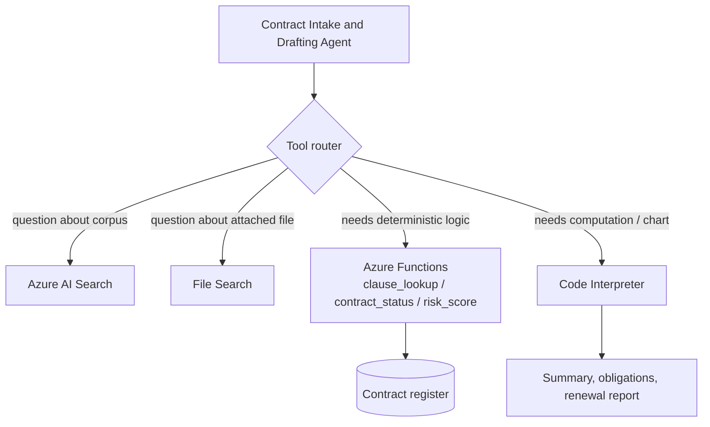

# Challenge 3 &middot; Tools &amp; Actions

> **Duration:** ~75 minutes &middot; **Path:** Low-Code + Pro-Code &middot; **Previous:** [Challenge 2](./challenge-2-knowledge-grounding.md) &middot; **Next:** [Challenge 4 &mdash; Guardrails](./challenge-4-guardrails.md)

---

<!-- CHALLENGE-SUMMARY:v1 -->
## Challenge summary

| Field | Value |
| --- | --- |
| **Objective** | Attach the five canonical Contract Lifecycle Management tools to the agent and prove end-to-end orchestration. |
| **Agent capability** | Full CLM workflow &mdash; search, clause analysis, repository pull, approval routing, and status read/write in one conversation. |
| **Tool integration** | **Contract Search** (Azure AI Search) &middot; **Clause Analysis** (Azure AI Foundry Models) &middot; **Contract Repository** (SharePoint) &middot; **Approval Routing** (Power Automate) &middot; **Contract Status** (Dataverse / Azure SQL). |
| **Azure services used** | Azure AI Search, Azure AI Foundry Models, SharePoint, Power Automate, Dataverse (or Azure SQL). |
| **Expected outcome** | The agent runs the scripted scenario in a single thread, routes approvals, updates status, and every tool call is visible in App Insights. |

---
## 1. Context

An agent that can only read is a chatbot. In this challenge you turn the CLM assistant into a real **enterprise agent** by giving it the five tools that cover the full Contract Lifecycle Management workflow: **Contract Search**, **Clause Analysis**, **Contract Repository**, **Approval Routing**, and **Contract Status**.

Every tool needs a clear reason to exist. The agent doesn't get to pick tools it doesn't need &mdash; the more tools, the more misrouting risk.

## 2. Business context

The real workday of a Legal or Procurement analyst is stitched together across search, contract lookup, clause analysis, approval routing, and status updates. This challenge wires each of those into a single conversation.

## 3. Objective

Register the five canonical Contract Lifecycle Management tools with the Contract Intake &amp; Drafting Agent, teach it when to use each, and prove it end-to-end with a scripted scenario.

| # | Tool | Connected service | Purpose | Expected outcome |
| --- | --- | --- | --- | --- |
| 1 | **Contract Search Tool** | Azure AI Search | Hybrid (vector + semantic) retrieval across the contract corpus | Grounded answers with citations to the exact clause or paragraph |
| 2 | **Clause Analysis Tool** | Azure AI Foundry Models | LLM-driven clause explanation, rewrite, and risk flagging against the approved-clause library | Plain-language explanations and risk callouts with source references |
| 3 | **Contract Repository Tool** | SharePoint | Read approved templates, executed contracts, and policies from the enterprise DMS | Correct template pulled by contract type; executed contract retrieved by ID |
| 4 | **Approval Routing Tool** | Power Automate | Kick off Legal / Procurement / Finance approval flows and return the approval id | Approval routed to the correct role and tracked to closure |
| 5 | **Contract Status Tool** | Dataverse (or Azure SQL) | Read / update contract lifecycle state: stage, owner, renewal date, expiry | Deterministic status answers; renewals never missed |

> **Design note.** Approval routing runs on Power Automate, using native Microsoft 365 approval primitives (SharePoint, Teams, Outlook). Contract status lives in Dataverse (or Azure SQL) as a data connector, so the agent reads and writes structured lifecycle state deterministically. Clause analysis is a language task the Foundry model performs directly; there is no external microservice.

## 4. Learning outcome

After Challenge 3 you can:

- Design a small, orthogonal tool set the agent can route to reliably.
- Register Foundry tools of three shapes: **built-in** (Azure AI Search, Foundry Models), **connector-based Agent Actions** (SharePoint, Power Automate, Dataverse), and **prompted-analysis** (Clause Analysis via the model).
- Write a TOOL ROUTING block that stops the agent from firing the wrong tool.
- Confirm irreversible actions with the user before firing them.

## 5. Prerequisites

- Challenge 2 complete (agent, index, corpus grounding all working).
- A Microsoft 365 tenant with **Power Automate**, **SharePoint**, and **Dataverse** (or an Azure SQL database you can stub) &mdash; or a mocked HTTP endpoint per tool.

## 6. Architecture diagram



## 7. Tool 1 &mdash; Contract Search Tool (Azure AI Search)

### Purpose
Find contracts, clauses, and policies in the enterprise corpus using hybrid vector + semantic retrieval.

### Connected service
**Azure AI Search** &mdash; already provisioned and indexed in Challenge 2.

### Expected outcome
Every answer that references corpus content includes a citation to the exact document, clause, or paragraph.

### Configuration
Already attached in Challenge 2. Confirm: agent &rarr; **Tools** &rarr; **Azure AI Search**, top-k `5`.

### Sample prompts
- *"Find every contract with Contoso from 2025."*
- *"What is our standard liability cap?"*

## 8. Tool 2 &mdash; Clause Analysis Tool (Azure AI Foundry Models)

### Purpose
Explain a clause in plain English, rewrite it against an approved version, and flag deviations or risky language.

### Connected service
**Azure AI Foundry Models** &mdash; the same `gpt-4o` / `gpt-4o-mini` deployment powering the agent. Clause analysis is a language task, so it runs on the model directly instead of a bespoke microservice. This keeps latency low, avoids an extra hop, and lets prompt engineering evolve without redeploying code.

### Expected outcome
The agent returns a structured analysis: a plain-English explanation, a side-by-side comparison to the approved clause, and a risk flag (Low / Medium / High) with reasons.

### Configuration
Exposed as a named skill in the agent instructions ("When asked to analyze a clause, follow the CLAUSE ANALYSIS protocol&hellip;"). See the CLAUSE ANALYSIS block in Challenge 1's instructions template.

### Sample prompts
- *"Explain this indemnification clause to me in plain English."*
- *"Compare the liability clause in this draft to our approved liability clause and flag any risk."*
- *"Rewrite this termination clause to match our standard."*

## 9. Tool 3 &mdash; Contract Repository Tool (SharePoint)

### Purpose
Read approved templates, executed contracts, and policy documents from the enterprise DMS.

### Connected service
**SharePoint** &mdash; the enterprise contract repository. Contracts, templates, and policies already live there, so the agent reads them in place rather than duplicating a second store.

### Expected outcome
When a user asks for a template by contract type ("give me the NDA template") or by contract ID ("pull CON-2024-0417"), the correct document URL and metadata come back.

### Low-code setup (portal)

Foundry portal &rarr; agent &rarr; **Actions** &rarr; **+ Add action** &rarr; **SharePoint**.

1. Choose the SharePoint site hosting the CLM library (e.g. `Legal / Contract Repository`).
2. Select the document libraries the agent may read: **Templates**, **Executed Contracts**, **Policies**.
3. Save the connection. Set the action name to `get_contract_document`.

### Register with the agent
The SharePoint action appears as a named tool. Set the display name to `get_contract_document` and describe input parameters: `document_type` (`template` | `executed`), `contract_type_or_id`.

### Sample prompts
- *"Pull our approved mutual NDA template."* &rarr; `get_contract_document(document_type="template", contract_type_or_id="mutual-nda")`.
- *"Show me contract CON-2024-0417."* &rarr; `get_contract_document(document_type="executed", contract_type_or_id="CON-2024-0417")`.

## 10. Tool 4 &mdash; Approval Routing Tool (Power Automate)

### Purpose
Route contract drafts to the correct approver (Legal / Procurement / Finance) for sign-off. Send renewal reminders. Escalate stale approvals.

### Connected service
**Power Automate** &mdash; approval flows are the standard in Microsoft 365 (SharePoint approvals, Teams approvals, Outlook approvals). Power Automate is the native Foundry Agent Actions integration for those primitives.

### Expected outcome
Every AI-suggested contract action produces an auditable approval trail. The tool returns an `approval_id` the agent can quote back.

### Low-code setup (portal)

Create the Power Automate flow:

1. `make.powerautomate.com` &rarr; **+ Create** &rarr; **Instant cloud flow** &rarr; **When an HTTP request is received**.
2. Request body JSON schema:

   ```json
   {
     "type": "object",
     "properties": {
       "subject":      { "type": "string" },
       "requester":    { "type": "string" },
       "counterparty": { "type": "string" },
       "doc_uri":      { "type": "string" },
       "risk_band":    { "type": "string" },
       "approver_role":{ "type": "string" }
     }
   }
   ```

3. Action: **Approvals &mdash; Start and wait for an approval** (or **Send approval email** for the async pattern). Target the mailbox that matches `approver_role` (legal / procurement / finance).
4. Action: **Response** &rarr; `200 OK` with:

   ```json
   { "approval_id": "@{workflow().run.name}", "status": "pending" }
   ```

5. Save. Copy the **HTTP POST URL** and store it in `.env` as `POWER_AUTOMATE_APPROVAL_URL`.

### Register with the agent
Foundry portal &rarr; agent &rarr; **Actions** &rarr; **+ Add action** &rarr; **Power Automate** &rarr; select the flow you just created. Name the action `route_approval`.

### Sample prompt
- *"Route the Contoso NDA for legal approval."* &rarr; agent asks for confirmation, then fires `route_approval` and returns the `approval_id`.

## 11. Tool 5 &mdash; Contract Status Tool (Dataverse / SQL)

### Purpose
Read and update the deterministic lifecycle state of any contract: stage, owner, renewal date, expiry.

### Connected service
**Dataverse** (or **Azure SQL**) &mdash; contract state is structured, queryable, and mutated by workflows. Dataverse gives a low-code CRUD surface that native Foundry Agent Actions can hit directly. If your organization already keeps contract state in SQL, the same tool pattern applies with the SQL Server connector.

### Expected outcome
Status lookups return a canonical row: `{ contract_id, stage, owner, renewal_date, expiry, updated_at }`. Status updates are captured with a full audit trail (who changed what, when).

### Dataverse table (minimum schema)

| Column | Type | Purpose |
| --- | --- | --- |
| `contract_id` | Text (PK) | Business identifier, e.g. `CON-2024-0417` |
| `stage` | Choice | `Draft`, `In Review`, `Approved`, `Signed`, `Active`, `Expired` |
| `owner` | Lookup / Text | Contract owner |
| `renewal_date` | Date | Next renewal or auto-renew date |
| `expiry` | Date | Termination / expiry date |
| `risk_band` | Choice | `Low`, `Medium`, `High` |
| `updated_at` | Date &amp; Time | Auto-set on any write |

### Low-code setup (portal)

Foundry portal &rarr; agent &rarr; **Actions** &rarr; **+ Add action** &rarr; **Dataverse** (or **SQL Server**). Grant read + update on the `clm_contracts` table. Register two operations:

- `get_contract_status(contract_id)` &rarr; returns the row.
- `update_contract_status(contract_id, new_stage)` &rarr; updates `stage` and stamps `updated_at`.

### Register with the agent
Name the actions `get_contract_status` and `update_contract_status`. Document the input schema in the action description so the agent knows to always pass a `contract_id`.

### Sample prompts
- *"What state is contract CON-2024-0417?"* &rarr; `get_contract_status(contract_id="CON-2024-0417")`.
- *"Mark CON-2024-0417 as In Review."* &rarr; agent asks to confirm, then `update_contract_status(contract_id="CON-2024-0417", new_stage="In Review")`.

> **Why not an Azure Function?** An Azure Function wrapping a SQL query would work, but it's an extra hop, an extra deployment, and an extra thing to secure. Dataverse (or the SQL Server connector) speaks directly to Foundry Agent Actions, so the agent gets a typed, audited read/write surface with no custom code.

## 11. TOOL ROUTING block (append to instructions)

Append this to your agent instructions after DRAFTING RULE:

```text
# TOOL ROUTING
- Retrieval about a template, clause, policy, or historical contract -> Contract Search Tool (Azure AI Search).
- User wants a template or executed contract pulled from the repository -> get_contract_document(document_type, contract_type_or_id).
- User wants a clause explained, rewritten, or risk-flagged -> follow the CLAUSE ANALYSIS protocol using the Foundry model. Cite the approved clause every time.
- User asks about a contract's lifecycle state -> get_contract_status(contract_id).
- User asks to change a contract's stage -> update_contract_status(contract_id, new_stage). Always confirm before writing.
- User asks to route for approval / sign-off / legal / procurement / finance review -> route_approval(...).
  Always confirm the payload with the user in one sentence before firing.
- Never invent contract IDs, approval IDs, or stages. Ask the user or call the appropriate tool.
```

## 12. Pro-code path &mdash; SDK walkthrough

Reference: [app/tools.py](../app/tools.py) exposes each tool as a Python function. The dispatch loop that maps function-tool calls back into `tools.py` is built into `create_and_process_run` when you register `FunctionTool` &mdash; no extra glue required.

```python
from azure.ai.projects.models import FunctionTool
from app.contract_agent import client, get_agent
from app import tools

# Function-shaped tools: SharePoint, Power Automate, and Dataverse
# operations are wrapped as Python functions in app/tools.py.
functions = FunctionTool(functions={
    tools.get_contract_document,      # SharePoint (Contract Repository)
    tools.route_approval,             # Power Automate (Approval Routing)
    tools.get_contract_status,        # Dataverse / SQL (Contract Status - read)
    tools.update_contract_status,     # Dataverse / SQL (Contract Status - write)
})

agent = get_agent()
client.agents.update_agent(
    agent_id=agent.id,
    tools=[*functions.definitions],
)
```

The **Contract Search Tool** (Azure AI Search) remains attached from Challenge 2. The **Clause Analysis Tool** is exercised through the CLAUSE ANALYSIS section of the agent instructions rather than a separate tool binding.

## 13. End-to-end scenario

Run this scenario in one thread. Every step should feel like a single conversation.

1. *"I need a mutual NDA with Contoso, effective 2026-08-01, 2-year term."* &rarr; intake protocol.
2. *"Pull our approved NDA template."* &rarr; `get_contract_document(document_type="template", contract_type_or_id="mutual-nda")`.
3. *"Explain the liability clause in that template and flag any risk."* &rarr; Clause Analysis Tool (Foundry model, following CLAUSE ANALYSIS protocol).
4. *"Fill the template and route for legal approval."* &rarr; draft, then agent asks: *"I will route this to Legal with risk band Medium. Confirm?"* &rarr; on yes, `route_approval(...)`.
5. *"Mark the NDA as In Review."* &rarr; agent asks to confirm, then `update_contract_status(contract_id="CON-2026-0001", new_stage="In Review")`.
6. *"What is the current status?"* &rarr; `get_contract_status(contract_id="CON-2026-0001")`.

## 14. Testing

Verify in App Insights that each turn produced a `gen_ai.tool.call` event with the expected tool name. Bad routing (fires `route_approval` for a clause explanation, for example) means TOOL ROUTING needs to be more specific.

## 15. Validation

| Check | How to verify | Pass criteria |
| --- | --- | --- |
| All five tools registered | Portal &rarr; agent &rarr; Tools / Actions | Contract Search, Clause Analysis (via instructions), Contract Repository, Approval Routing, Contract Status |
| Contract Search | *"Find every contract with Contoso"* | Cites real corpus docs |
| Clause Analysis | *"Explain this indemnification clause and flag risk."* | Structured analysis + risk band + citation |
| Contract Repository | *"Pull our approved NDA template."* | `get_contract_document` returns the correct SharePoint URL |
| Approval Routing | *"Route the Contoso NDA for approval."* | Agent confirms, `route_approval` returns `approval_id` |
| Contract Status | *"Mark CON-2024-0417 as Signed."* | Agent asks to confirm, then `update_contract_status` writes to Dataverse |
| SDK parity | `python -m app.sample_run --challenge 3` | Same behavior end-to-end |

## 16. Success criteria

The end-to-end scenario in [section 13](#13-end-to-end-scenario) completes in one thread, produces the right tool calls in the right order, and the trace in App Insights shows every step.

## 17. Completion checklist

- [ ] Power Automate approval flow deployed; `POWER_AUTOMATE_APPROVAL_URL` in `.env`.
- [ ] SharePoint Agent Action connected for the CLM contract library; templates and executed contracts readable.
- [ ] Dataverse table `clm_contracts` created (or Azure SQL equivalent); `get_contract_status` and `update_contract_status` actions registered.
- [ ] All five tools available on the agent (Contract Search, Clause Analysis via instructions, Contract Repository, Approval Routing, Contract Status).
- [ ] TOOL ROUTING block appended to instructions.
- [ ] End-to-end scenario runs in a single thread.
- [ ] App Insights shows each `gen_ai.tool.call` event.
- [ ] Agent asks to confirm before any irreversible action (status write, approval routing).

## 18. Next challenge

Continue to [Challenge 4 &mdash; Guardrails](./challenge-4-guardrails.md).

