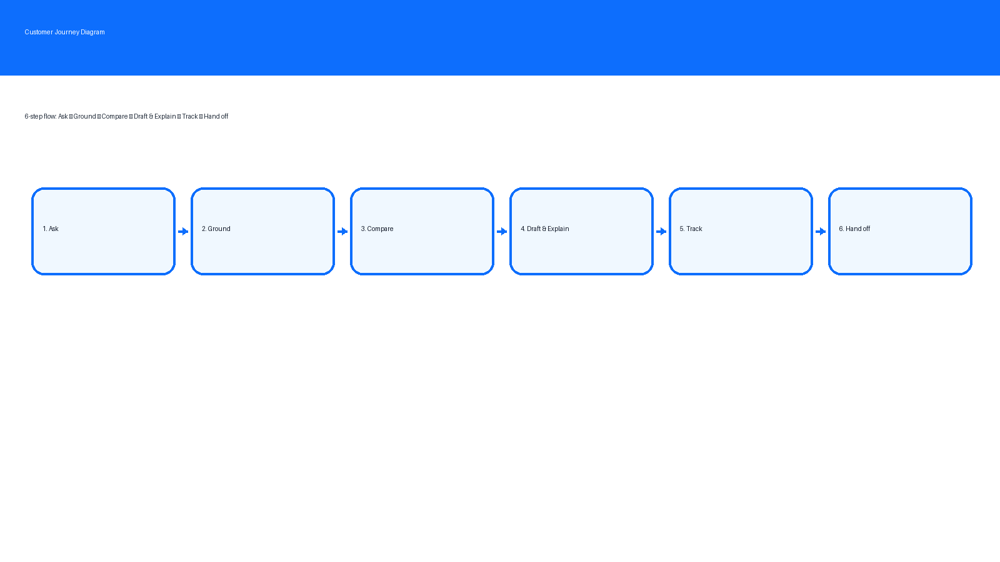
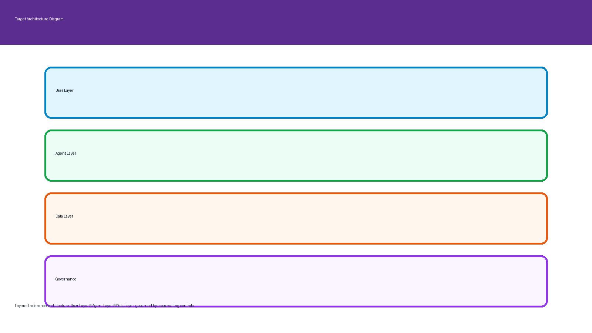
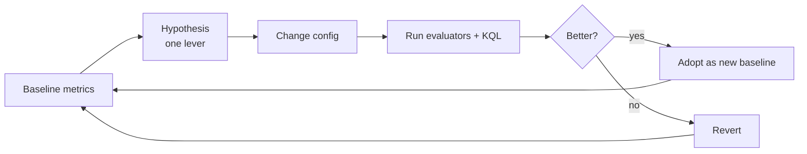

# Challenge 7 &middot; Optimization

> **Duration:** ~45 minutes &middot; **Path:** Low-Code + Pro-Code &middot; **Previous:** [Challenge 6](./challenge-6-evaluation.md) &middot; **Next:** [Challenge 8 &mdash; Publish](./challenge-8-publish.md)

---

<!-- CHALLENGE-SUMMARY:v1 -->
## Challenge summary

| Field | Value |
| --- | --- |
| **Objective** | Optimize across model, prompt, retrieval, and tool selection to hold or improve quality at lower cost and latency. |
| **Agent capability** | Same quality, cheaper and faster &mdash; a repeatable sweep the team can run every quarter. |
| **Tool integration** | Tunes retrieval parameters and tool-selection heuristics without changing the three-tool contract. |
| **Azure services used** | Azure AI Evaluation SDK, Azure AI Foundry Models. |
| **Expected outcome** | Cost per session reduced with quality maintained or improved. Before/after scorecards recorded. |

---
## 1. Context

The gate is green &mdash; but the assistant is still using the biggest model, a generous retrieval budget, and a verbose prompt. In this challenge you sweep the levers, measure with the evaluator you just built, and pick the config with the best quality-per-dollar.

## 2. Business context

CLM traffic is spiky: 20&ndash;50 requests per hour during Legal review windows, near-zero at night. A 30% cost cut on the model + 20% latency cut on retrieval materially changes what pilot rollout looks like.

## 3. Objective

Run a **controlled sweep** of five configurations against the Challenge 6 dataset and produce a before/after table showing quality, latency, and cost.

## 4. Learning outcome

After Challenge 7 you can:

- Design a small sweep that isolates one variable at a time.
- Change the model, the prompt, the chunking, the retrieval top-k, and the tool set &mdash; reproducibly.
- Read a quality vs cost curve and defend the choice you made.
- Turn the winner into a permanent config change with a note in the PR describing the tradeoff.

## 5. Prerequisites

- Challenges 0&ndash;6 complete.
- `python -m app.evaluation` passes on the baseline.
- A second model deployment: `gpt-4o-mini` in the same Foundry project (Portal &rarr; Models + endpoints &rarr; Deploy).

## 6. Continuous improvement loop



*Customer journey context: Ask &rarr; Ground &rarr; Compare &rarr; Draft &amp; Explain &rarr; Track &rarr; Hand off.*



*Target architecture reference: User Layer, Agent Layer, Data Layer, and Governance.*



## 7. The five configurations

| Run | Model | Prompt | Chunk size / top-k | Tools | Hypothesis |
| --- | --- | --- | --- | --- | --- |
| **Baseline** | gpt-4o | v1 (full) | 1024 / 5 | 3 tools | Reference |
| **A** | **gpt-4o-mini** | v1 | 1024 / 5 | 3 tools | Cheaper model may hold quality on this narrow task |
| **B** | gpt-4o | **v2 (tight)** | 1024 / 5 | 3 tools | Shorter instructions may reduce prompt tokens without hurting behavior |
| **C** | gpt-4o | v1 | **512 / 8** | 3 tools | Smaller chunks + wider top-k may improve grounding |
| **D** | gpt-4o | v1 | 1024 / 5 | **2 tools (drop WebIQ)** | Removing external web calls may cut latency for corpus-only workloads |

## 8. What to record

For each run, capture:

- `groundedness.mean`, `relevance.mean`, `task_adherence.mean`
- `indirect_attack.defect_rate` and each safety defect rate
- `avg_latency_ms` (from `requests` in App Insights) on `agent.turn`
- `avg_tokens_per_turn` (from KQL 9.1 in Challenge 5)
- `estimated_cost_per_1000_turns` (`(avg input tokens * $in + avg output tokens * $out) * 1000`, using your model's published pricing)

## 9. Low-code path &mdash; Portal walkthrough

For each run:

1. Foundry &rarr; agent &rarr; **Edit**.
2. Change one lever (model, instructions, index settings, tool list).
3. **Evaluations** &rarr; **+ Run** &rarr; same dataset, same evaluators.
4. Note the numbers in the table.
5. Revert if it didn't win.

## 10. Pro-code path &mdash; SDK walkthrough

Script every run through the same `evaluate()` call. Recommended pattern:

```python
import json, pathlib
from app.evaluation import run_gate
from app.contract_agent import client, get_agent
from app.config import settings

RUNS = [
    dict(name="baseline",  model=settings.model_deployment, instructions_path=None,  top_k=5, chunk=1024, drop_tools=[]),
    dict(name="A_mini",    model="gpt-4o-mini",             instructions_path=None,  top_k=5, chunk=1024, drop_tools=[]),
    dict(name="B_prompt2", model=settings.model_deployment, instructions_path="prompts/v2.txt", top_k=5, chunk=1024, drop_tools=[]),
    dict(name="C_chunk",   model=settings.model_deployment, instructions_path=None,  top_k=8, chunk=512,  drop_tools=[]),
    dict(name="D_no_webiq",model=settings.model_deployment, instructions_path=None,  top_k=5, chunk=1024, drop_tools=["web_research"]),
]

report = {}
for r in RUNS:
    # apply the config to the agent (portal or SDK), then:
    metrics = run_gate()
    report[r["name"]] = metrics

pathlib.Path("optimization-report.json").write_text(json.dumps(report, indent=2))
```

Commit `optimization-report.json` alongside your winner PR.

## 11. Sample result table

Fill in with your real numbers.

| Run | groundedness | task adherence | avg latency (ms) | avg tokens / turn | cost per 1k turns |
| --- | --- | --- | --- | --- | --- |
| Baseline | 4.42 | 4.35 | 3,850 | 2,410 | $6.02 |
| A (mini) | 4.05 | 4.21 | 2,110 | 2,410 | $0.72 |
| B (tight prompt) | 4.40 | 4.33 | 3,720 | 2,140 | $5.34 |
| C (chunk 512, top-k 8) | 4.51 | 4.30 | 4,120 | 2,880 | $7.20 |
| D (no WebIQ) | 4.42 | 4.31 | 3,290 | 2,410 | $6.02 |

**Read of the sample:** Run A trades ~7% task adherence for 4x cost saving &mdash; adopt for the pilot with an easy rollback to Baseline for high-stakes traffic. Run B is a free win on prompt cost. Run C improves grounding but crosses the cost threshold. Run D cuts latency without hurting the gate; adopt for tenants that only need corpus + status and don't need external research.

## 12. Cost KQL

Group cost per day and per agent config:

```kql
customMetrics
| where name == "gen_ai.client.token.usage"
| extend model = tostring(customDimensions["gen_ai.request.model"])
| extend io    = tostring(customDimensions["gen_ai.usage.output_type"])
| summarize tokens = sum(valueSum) by bin(timestamp, 1d), model, io
| render timechart
```

## 13. Latency KQL

```kql
requests
| where cloud_RoleName == "clm-agent" and operation_Name == "agent.turn"
| summarize p50 = percentile(duration, 50), p95 = percentile(duration, 95),
            calls = count() by bin(timestamp, 1h)
| render timechart
```

## 14. Optimization checklist

- [ ] Baseline metrics recorded from Challenge 6.
- [ ] Model swap A run and recorded.
- [ ] Prompt-tightened B run and recorded (keep v1 archived).
- [ ] Chunk / top-k C run and recorded.
- [ ] Tool-drop D run and recorded (WebIQ disabled).
- [ ] Winner identified with a written rationale.
- [ ] Winner's config applied to `contract-intake-drafting-agent`.
- [ ] `optimization-report.json` committed.
- [ ] KQL 12 &amp; 13 saved to the shared dashboard.

## 15. Validation

| Check | How to verify | Pass criteria |
| --- | --- | --- |
| All 5 runs executed | `optimization-report.json` | 5 keys, each with 8+ metrics |
| Gate still green | `python -m app.evaluation` on winner | Prints "passes the deployment gate" |
| Cost measurable | KQL 12 | Chart shows tokens by model + day |
| Latency measurable | KQL 13 | Chart shows p50 + p95 per hour |
| Rationale documented | PR description | Names the winner and the tradeoff |

## 16. Success criteria

You can defend the winning config in one sentence: *"We chose X because it moves quality by delta Q and cost by delta $, with no safety regression."* &mdash; and the numbers are in the repo.

## 17. Next challenge

Continue to [Challenge 8 &mdash; Publish](./challenge-8-publish.md).
