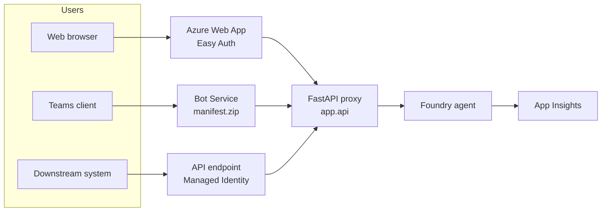

# Challenge 8 &middot; Publish

> **Duration:** ~60 minutes &middot; **Path:** Low-Code + Pro-Code &middot; **Previous:** [Challenge 7](./challenge-7-optimization.md)

---

<!-- CHALLENGE-SUMMARY:v1 -->
## Challenge summary

| Field | Value |
| --- | --- |
| **Objective** | Publish the agent as a Web App with Easy Auth, a Teams app, or an authenticated API endpoint. |
| **Agent capability** | End-user access &mdash; pilot users complete real Contract Lifecycle Management tasks from a real channel. |
| **Tool integration** | All five tools reachable via the shipped channel. A scheduled Azure Function is added *only* for the batch renewal-reminder job (a non-conversational workload the agent should not own). |
| **Azure services used** | Azure App Service (Easy Auth), Microsoft Teams, Managed Identity, Azure Storage Queue + Azure Functions (for the renewal reminder batch only). |
| **Expected outcome** | A pilot user completes an end-to-end scenario from Teams or the Web App and every action is traced. |

---
## 1. Context

Time to put the assistant in front of real users. You will pick one deployment target (or all three) and ship a working, authenticated, traced version to a pilot group of Legal + Procurement.

## 2. Business context

The pilot group is 10&ndash;30 reviewers, most of whom live in Teams. A small number will prefer a web link. A handful of downstream systems (renewal reminders, ticketing) need a plain API. All three access paths route to the same Foundry agent so behavior stays consistent.

## 3. Objective

Ship the CLM assistant to at least one of:

- **Web App** with Easy Auth + Entra ID group `Contracts-Users`.
- **Teams App** via Bot Service and a `manifest.zip`.
- **API endpoint** authenticated by Managed Identity for machine-to-machine callers.

Deployment must go through the Challenge 6 gate first.

## 4. Learning outcome

After Challenge 8 you can:

- Package a Foundry agent behind a FastAPI proxy that Streams responses to a browser.
- Configure Easy Auth on an Azure Web App with an Entra group as the authorized scope.
- Build and side-load a Teams manifest that surfaces the agent as a bot.
- Wire a Managed Identity to call the Foundry data-plane with a bearer token.

## 5. Prerequisites

- Challenges 0&ndash;7 complete.
- Deployment gate green on `main`.
- Owner-level rights on the resource group (needed for role assignments).
- An Entra group `Contracts-Users` &mdash; you can create one in the Azure portal.

## 6. Architecture &mdash; end-to-end



## 7. Track A &mdash; Web App with Easy Auth (~10 minutes)

### 7.1 Package a minimal FastAPI proxy

Reference: [app/api.py](../app/api.py) (create if missing):

```python
from fastapi import FastAPI, HTTPException, Depends, Request
from pydantic import BaseModel
from app.contract_agent import client, get_agent

app = FastAPI(title="CLM Agent API")

class Turn(BaseModel):
    thread_id: str | None = None
    message: str

@app.post("/api/turn")
def turn(t: Turn, request: Request):
    principal = request.headers.get("X-MS-CLIENT-PRINCIPAL-NAME", "anonymous")
    thread_id = t.thread_id or client.agents.create_thread().id
    client.agents.create_message(thread_id=thread_id, role="user", content=t.message)
    client.agents.create_and_process_run(thread_id=thread_id, agent_id=get_agent().id)
    reply = client.agents.list_messages(thread_id).data[0].content[0].text.value
    return {"thread_id": thread_id, "reply": reply, "user": principal}
```

### 7.2 Deploy

```powershell
az webapp up -g rg-clm-hackathon -n web-clm-<your-alias> `
  --runtime "PYTHON:3.11" --sku B1 --location eastus2 `
  --startup-file "uvicorn app.api:app --host 0.0.0.0 --port 8000"
```

Then set app settings from `.env`:

```powershell
az webapp config appsettings set -g rg-clm-hackathon -n web-clm-<your-alias> --settings `
  AZURE_AI_PROJECT_CONNECTION_STRING="<>" `
  AZURE_OPENAI_DEPLOYMENT=gpt-4o `
  APPLICATIONINSIGHTS_CONNECTION_STRING="<>"
```

### 7.3 Turn on Easy Auth

Azure portal &rarr; Web App &rarr; **Authentication** &rarr; **Add identity provider** &rarr; **Microsoft**.

- **Restrict access:** Require authentication.
- **Allowed audiences / groups:** add group `Contracts-Users`.

### 7.4 Assign the app's Managed Identity permission to the Foundry project

Azure portal &rarr; Web App &rarr; **Identity** &rarr; **System assigned** &rarr; **On**. Copy the object id.

Then on the Foundry project: **Access control (IAM)** &rarr; **+ Role assignment** &rarr; role `Cognitive Services User` &rarr; assign to the Web App's identity.

### 7.5 Test

```powershell
$token = az account get-access-token --resource "https://web-clm-<your-alias>.azurewebsites.net" --query accessToken -o tsv
Invoke-RestMethod -Method POST -Uri "https://web-clm-<your-alias>.azurewebsites.net/api/turn" `
  -Headers @{ Authorization = "Bearer $token" } `
  -ContentType "application/json" `
  -Body '{"message":"I need an NDA with Contoso."}'
```

## 8. Track B &mdash; Teams App (~10 minutes)

### 8.1 Create a bot resource

Azure portal &rarr; **Azure Bot** &rarr; **Create**.

- Bot handle: `bot-clm-<your-alias>`
- Data residency: match your tenant.
- Type: **Multi-tenant** (or SingleTenant, whatever your policy allows).
- Messaging endpoint: `https://web-clm-<your-alias>.azurewebsites.net/api/messages` (you will need a small `bot_framework_adapter` handler in FastAPI).

### 8.2 Add the Teams channel

Bot &rarr; **Channels** &rarr; **Microsoft Teams** &rarr; Enable.

### 8.3 Build a Teams manifest

```powershell
# structure/teams/
#   manifest.json  color.png  outline.png
Compress-Archive -Path structure/teams/* -DestinationPath manifest.zip
```

`manifest.json` skeleton:

```json
{
  "manifestVersion": "1.19",
  "id": "<GUID>",
  "packageName": "com.contoso.clm.agent",
  "version": "1.0.0",
  "developer": { "name": "Contoso", "websiteUrl": "https://contoso.com",
                 "privacyUrl": "https://contoso.com/privacy",
                 "termsOfUseUrl": "https://contoso.com/tos" },
  "name": { "short": "CLM Assistant", "full": "Contract Lifecycle Management Assistant" },
  "description": { "short": "AI-powered contract intake and drafting.",
                   "full": "Draft NDAs, MSAs, and SOWs from approved templates and clauses." },
  "icons": { "color": "color.png", "outline": "outline.png" },
  "accentColor": "#0078D4",
  "bots": [ { "botId": "<BOT-APP-ID>", "scopes": ["personal", "team"], "supportsFiles": true } ],
  "validDomains": [ "web-clm-<your-alias>.azurewebsites.net" ]
}
```

### 8.4 Side-load into Teams

Teams client &rarr; **Apps** &rarr; **Manage your apps** &rarr; **Upload a custom app** &rarr; select `manifest.zip`.

### 8.5 Test

DM the app: *"Draft an NDA with Contoso, effective 2026-08-01, 2-year term."* &mdash; verify the reply matches the web app's reply for the same prompt.

## 9. Track C &mdash; API endpoint (~5 minutes)

If you completed Track A, the API is already live at `POST /api/turn` behind Easy Auth. For machine-to-machine callers:

1. Create a **service principal** for the caller (`az ad sp create-for-rbac`).
2. Grant it access to the Web App: portal &rarr; Web App &rarr; **Access control (IAM)** &rarr; role `Reader` on the app.
3. On the calling side, get a token with the Web App's audience and POST as in [7.5](#75-test).

For higher scale, host a separate **Azure Function** on a timer trigger that reads from a Storage Queue and posts to the CLM API on a schedule &mdash; useful for the **renewal reminder job**. This is the one place Azure Functions genuinely earn their keep: it is a scheduled, queue-driven batch process, not a conversational action, so the agent should not own it. The Function reads upcoming renewals from Dataverse and calls Power Automate to send reminders.

## 10. Governance checklist (before opening the pilot)

- [ ] **Identity:** Every user or system caller is authenticated (Easy Auth / SP).
- [ ] **Authorization:** Only `Contracts-Users` group has access.
- [ ] **Network:** Web App is behind Azure Front Door / Private Endpoint if the corpus is confidential.
- [ ] **Data:** No PII flows into App Insights (Challenge 4 redaction is on).
- [ ] **Observability:** Every request is traced (Challenge 5).
- [ ] **Quality gate:** Latest deploy passed Challenge 6 gate on `main`.
- [ ] **Lifecycle:** Deployment slots configured (`staging` + `production`), swap requires an approval.

## 11. CI/CD &mdash; gate then deploy

`.github/workflows/deploy.yml`:

```yaml
name: Deploy

on:
  push:
    branches: [main]

jobs:
  gate:
    uses: ./.github/workflows/gate.yml
    secrets: inherit

  deploy-web:
    needs: gate
    runs-on: ubuntu-latest
    environment: production
    steps:
      - uses: actions/checkout@v4
      - uses: azure/login@v2
        with: { creds: '${{ secrets.AZURE_CREDENTIALS }}' }
      - name: Deploy Web App
        run: |
          az webapp up -g rg-clm-hackathon -n web-clm-<your-alias> \
            --runtime "PYTHON:3.11" --sku B1 \
            --startup-file "uvicorn app.api:app --host 0.0.0.0 --port 8000"
```

The `gate` job blocks the deploy if the evaluators regressed.

## 12. Acceptance test &mdash; the 3-turn scenario

Ask any authenticated user to run this in Web + Teams + API and confirm the outputs match:

1. *"I need a mutual NDA with Contoso, effective 2026-08-01, 2-year term."*
2. *"Use our standard liability clause."*
3. *"Route this for legal approval."*

Then check App Insights &mdash; you should see three `agent.turn` spans for that user's identity.

## 13. Validation

| Check | How to verify | Pass criteria |
| --- | --- | --- |
| Web App live | `Invoke-RestMethod` from [7.5](#75-test) | Returns `{"thread_id","reply","user"}` |
| Easy Auth on | Anonymous request | Returns `401` |
| Teams app installed | Teams DM to the bot | Reply matches Web App |
| Managed identity works | Portal &rarr; Web App &rarr; Identity | Object id assigned `Cognitive Services User` on the project |
| CI gate blocks bad deploy | Push a change that fails Challenge 6 | Deploy job never runs |
| Traces per user | App Insights &rarr; last 15 min | Spans carry `enduser.id` from `X-MS-CLIENT-PRINCIPAL-NAME` |

## 14. Success criteria

A pilot user in `Contracts-Users` can complete the [acceptance test](#12-acceptance-test-the-3-turn-scenario) from at least one channel, the whole path is traced, and the deployment gate is enforced automatically in CI.

## 15. Completion checklist

- [ ] Track A (Web App) or Track B (Teams) or Track C (API) shipped.
- [ ] Easy Auth restricts access to `Contracts-Users`.
- [ ] Managed Identity has `Cognitive Services User` on the Foundry project.
- [ ] Governance checklist (section 10) fully green.
- [ ] `.github/workflows/deploy.yml` runs `gate` before `deploy`.
- [ ] Acceptance test passes on the shipped channel.
- [ ] Traces are visible per authenticated user.

## 16. Wrap-up

Congratulations &mdash; you shipped a grounded, tool-using, evaluated, traced CLM assistant on Microsoft Foundry. To keep it healthy:

- Re-run Challenge 6 on the same dataset weekly.
- Refresh the corpus and re-index whenever templates, clauses, or policies change.
- Watch the KQL dashboards from Challenge 5 for latency + cost drift.
- Grow the dataset every time you find a real-world regression: add the failing prompt to `evaluation_dataset.jsonl`.

Submit your fork URL and a 3&ndash;5 minute walkthrough on the [issues page](https://github.com/priyanka405/MS-Foundry-Microhack/issues) with the label `submission` to claim the **Foundry CLM Champion** badge.

