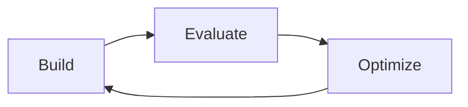

# Challenge 7 — Optimization

## 1. Title & Duration

**Challenge 7 — Optimization: Build → Evaluate → Optimize → Repeat**
⏱ **30 minutes**

## 2. Objective

Use the Challenge 6 baseline as the "before" number and drive at least one measurable improvement across these four levers:

1. **Model choice** — try a smaller / cheaper / newer model.
2. **Prompt quality** — refactor instructions, use variables, apply Agent Optimizer.
3. **Retrieval configuration** — chunk size, hybrid vs. semantic, top-K.
4. **Cost vs. accuracy** — measure the tradeoff explicitly.

Document **before / after** for each change.

## 3. Context

Foundry's improvement loop is explicit and boring on purpose:



- The **Model catalog** in Foundry lets you swap deployments without rewriting the agent.
- **Agent Optimizer** rewrites the system prompt against a labeled dataset — the same one you built in Challenge 6.
- The Foundry portal shows **cost per run** (input + output tokens × unit price) so you can graph accuracy vs. spend.

> **Build → Evaluate → Optimize → Repeat.**
> If you cannot show a before/after table, you have not optimized — you have merely fiddled.

## 4. Prerequisites

- [Challenge 6](../challenge6-evaluation/README.md) done — you have baseline metrics.
- `evaluation/testset.jsonl` and `evaluation/results.json` from Challenge 6 are in the repo.
- Quota for a **second** model deployment (e.g. `gpt-4o` alongside `gpt-4o-mini`).

## 5. Agents & Tools used

| Component | Used |
| --- | --- |
| **Model catalog** (compare deployments) | ✅ |
| **Agent Optimizer** | ✅ new |
| **Evaluators** from Challenge 6 | ✅ (re-run) |
| **Cost / token dashboards** | ✅ |

---

## 6. 🟢 Low-Code Steps (Portal)

1. **Baseline snapshot** — copy the Challenge 6 metrics into `evaluation/optimization.md` as the *"Before"* column (Task adherence, Groundedness, Latency P95, Cost/run).
2. **Deploy a second model**
   - Left nav → **Models + endpoints** → **+ Deploy base model** → `gpt-4o` (or `gpt-4o-mini-2024-07-18` if you started on `-2024-01-25`).
3. **Clone the agent to compare fairly**
   - **Agents** → `contract-intake-drafting` → **⋯** → **Duplicate as version B**.
   - On version B, change **Model** to the new deployment.
   - Save.
4. **Run Agent Optimizer**
   - **Agents** → version B → **Optimize** → **Prompt optimization**.
   - Input dataset: `evaluation/testset.jsonl`.
   - Objective: **Maximize task adherence subject to safety = pass**.
   - Click **Run**. Foundry produces a candidate instruction rewrite + diff.
   - Accept it if the eval-time metrics improve, otherwise keep the original.
5. **Tune retrieval** on version B
   - Open `idx-clm-corpus` → **Edit index**.
   - Try:
     - Chunk size **512 / overlap 50** (currently 1024 / 100).
     - **Query type** = `VECTOR_SEMANTIC_HYBRID` (already default) → also try `SEMANTIC` only for high-precision cases.
     - **Top-K** = 3 vs. 8.
6. **Re-run evaluation** on version B against the same `testset.jsonl` (Challenge 6 step 6).
7. Fill in the *"After"* column of `evaluation/optimization.md`:

   | Metric | Before (v1) | After (v2) | Δ |
   | --- | --- | --- | --- |
   | Task adherence (0–5) | 4.30 | 4.62 | +0.32 |
   | Groundedness (0–5) | 4.10 | 4.35 | +0.25 |
   | Latency P95 (ms) | 6 400 | 4 900 | −23% |
   | Cost / run (USD) | 0.038 | 0.011 | −71% |
   | Safety defects | 0 | 0 | — |

8. If version B wins on the metrics you care about, **promote it**: **Agents** → `contract-intake-drafting` → **⋯** → **Set as default**.

## 7. 🔵 Pro-Code Steps (SDK / VS Code)

### 7.1 Sweep the models

```python
# scripts/challenge7_model_sweep.py
import os, subprocess, json
from copy import deepcopy

MODELS = ["gpt-4o-mini", "gpt-4o", "gpt-4o-mini-2024-07-18"]
results = {}

for m in MODELS:
    os.environ["MODEL_DEPLOYMENT_NAME"] = m
    subprocess.check_call(["python", "scripts/challenge6_evaluate.py"])
    with open("evaluation/results.json") as f:
        results[m] = json.load(f)["metrics"]

with open("evaluation/model_sweep.json", "w") as f:
    json.dump(results, f, indent=2)
```

### 7.2 Optimize the prompt with Agent Optimizer (SDK)

```python
# scripts/challenge7_optimize_prompt.py
from azure.ai.projects import AIProjectClient
from azure.identity import DefaultAzureCredential
import os

client = AIProjectClient(endpoint=os.environ["PROJECT_ENDPOINT"],
                        credential=DefaultAzureCredential())

job = client.agents.optimizations.create(
    agent_id=os.environ["AGENT_ID"],
    dataset_path="evaluation/testset.jsonl",
    objective="task_adherence",
    safety_gate="pass",
    max_iterations=6,
)
client.agents.optimizations.wait(job.id)

improved = client.agents.optimizations.get(job.id).candidate_instructions
print("--- Improved instructions ---")
print(improved)

# Apply if evaluators improved:
if job.metrics["task_adherence.mean"] >= job.baseline["task_adherence.mean"]:
    client.agents.update_agent(agent_id=os.environ["AGENT_ID"],
                              instructions=improved)
```

### 7.3 Tune retrieval

```python
# scripts/challenge7_retrieval_sweep.py
CONFIGS = [
    {"top_k": 3, "query_type": "SIMPLE"},
    {"top_k": 5, "query_type": "VECTOR_SEMANTIC_HYBRID"},
    {"top_k": 8, "query_type": "VECTOR_SEMANTIC_HYBRID"},
]

for cfg in CONFIGS:
    apply_retrieval_config(cfg)          # updates the AzureAISearchTool params
    subprocess.check_call(["python", "scripts/challenge6_evaluate.py"])
    save_row("evaluation/retrieval_sweep.csv", cfg, load_metrics())
```

### 7.4 Track cost vs. accuracy

```python
# scripts/challenge7_pareto.py — plot cost vs. task adherence
import matplotlib.pyplot as plt, json
rows = json.load(open("evaluation/model_sweep.json"))
xs = [r["cost_per_run_usd"] for r in rows.values()]
ys = [r["task_adherence.mean"] for r in rows.values()]
plt.scatter(xs, ys)
for m, r in rows.items():
    plt.annotate(m, (r["cost_per_run_usd"], r["task_adherence.mean"]))
plt.xlabel("USD per run"); plt.ylabel("Task adherence (0–5)")
plt.title("Cost vs. Accuracy — CLM agent"); plt.grid(True)
plt.savefig("evaluation/pareto.png")
```

### 7.5 C# — model swap via the SDK

```csharp
await agents.UpdateAgentAsync(
    agentId: agentId,
    model: "gpt-4o");   // swap deployment, keep instructions + tools
```

## 8. Success Criteria

- [ ] Two model deployments exist in the project and were both evaluated on the same dataset.
- [ ] Agent Optimizer produced a candidate rewrite; either accepted with metrics up, or explicitly rejected with a note in `evaluation/optimization.md`.
- [ ] Retrieval sweep table exists in `evaluation/retrieval_sweep.csv`.
- [ ] `evaluation/pareto.png` (or an equivalent chart) shows cost vs. accuracy.
- [ ] `evaluation/optimization.md` documents at least **one** shipped improvement with before/after numbers.
- [ ] Post-optimization run still passes the **85% task-adherence** gate from Challenge 6.

## 9. Next Steps

You now have a **measured, tuned, safe** agent. **Challenge 8** is the last mile: publish it as a Web App, a Teams app, and a REST endpoint — with the governance/security/lifecycle checklist that lets it survive its first Monday.

➡ Continue to **[Challenge 8 — Publish](../challenge8-publish/README.md)**.

## 10. Key Takeaway

> Build → Evaluate → Optimize → Repeat. Everything else is folklore.
