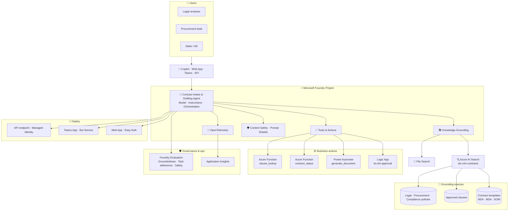
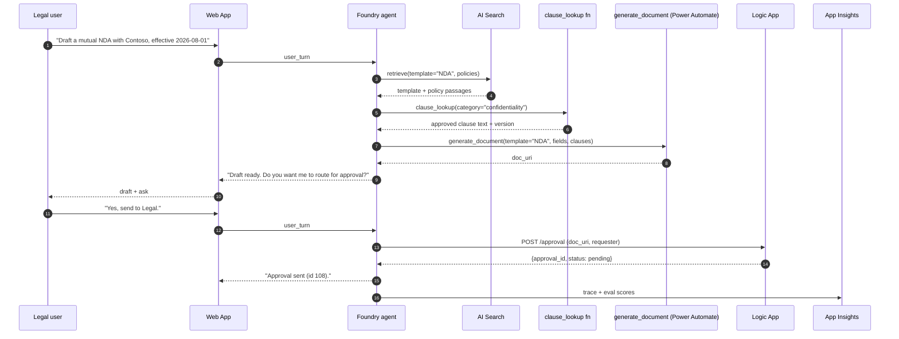

# Reference architecture

The **Contract Intake &amp; Drafting Agent** runs entirely inside a single **Microsoft Foundry** project. This document is the one-page reference for the shape of the solution.

## 🗺️ End-to-end diagram

## 🧩 Components at a glance

| Component | Purpose | Foundry surface |
| --- | --- | --- |
| **Model** | Reasoning engine (default: `gpt-4o`). | Model deployment |
| **Instructions** | Contract-drafting persona + policy rules. | Agent → Instructions |
| **Azure AI Search — `idx-clm-contracts`** | Vector + hybrid retrieval over templates, clauses, policies. | Tools → AzureAISearchTool |
| **File Search** | Session-scoped retrieval on user-attached documents. | Tools → FileSearchTool |
| **`clause_lookup`** | Function tool — returns approved clauses by category. | Tools → Azure Function |
| **`generate_document`** | Power Automate flow — fills a template. | Tools → HTTP tool |
| **`route_approval`** | Logic App — approval email + response. | Tools → HTTP tool |
| **`contract_status`** | Azure Function — reads/updates lifecycle state. | Tools → Azure Function |
| **Content Safety + Prompt Shields** | Blocks unsafe content and prompt-injection. | Project setting |
| **OpenTelemetry** | Emits traces to Application Insights. | `azure-monitor-opentelemetry` |
| **Foundry Evaluators** | Groundedness, Relevance, TaskAdherence, Safety scorers. | Evaluation tab |

## 🔁 A single request, end-to-end

## 🧱 Design principles

1. **Ground first.** No clause text without a citation from an approved source.
2. **Tools describe capability, not implementation.** Model routes on tool descriptions — treat them as prompts.
3. **Human in the loop for anything irreversible.** Approvals, generation, and status updates are proposed and confirmed.
4. **Evaluate before you ship.** Task adherence &amp; groundedness gates enforced in CI.
5. **Observable by default.** OpenTelemetry to App Insights from day one.
6. **Managed Identity everywhere.** No API keys in code.

## 🔧 When to change this architecture

| Signal | Change |
| --- | --- |
| &gt; 100k templates / policies / clauses | Partition the AI Search index; add a routing agent. |
| Multi-language contracts | Add a translation step at index-time; keep source in a separate field. |
| Regulated (finance / gov) | Add Private Endpoints + CMK on Search + Storage; enable Purview labels. |
| Multiple contract domains | Split into a **Retriever** + **Drafter** + **Approver** multi-agent workflow. |
| High-volume automated intake | Batch API + async runs with a queue; keep the same eval gate. |
