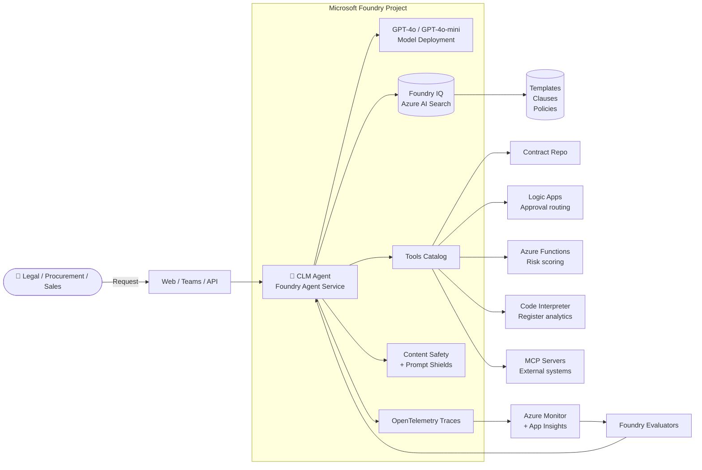

# Microsoft Foundry: Contract Lifecycle Management (CLM) Agent

> **From Prototype to Production** — build a multi-agent CLM system end-to-end in **one Microsoft Foundry project**.

---

## Hero

**Tagline:** *Turn contract chaos into a governed, observable, and measurable AI workflow — in a single afternoon.*

Legal, procurement, and sales teams live inside contracts, but the workflow is stuck in email, Word, and shared drives. In this MicroHack you will build a **Contract Lifecycle Management (CLM) Agent** on **Microsoft Foundry** that captures contract requests, drafts from approved templates, grounds answers in a clause library, routes approvals, and tracks renewals — with the guardrails, telemetry, and evaluations required to actually put it in production.

---

## Overview

You will build a **multi-agent Contract Lifecycle Management system** end-to-end inside **one Microsoft Foundry project**. Every challenge has **two tracks** so business builders and pro-code developers move in lockstep:

- 🟢 **Low-Code** → Foundry portal at [ai.azure.com](https://ai.azure.com): visual Agent Builder, Tools catalog, Playground.
- 🔵 **Pro-Code** → VS Code + **Foundry Toolkit** extension + **Azure AI Projects SDK** (Python & C#).

Both tracks converge on the **same Foundry project, agent, tools, and evaluations** — so a mixed team can hand work back and forth.

---

## The Foundry Lifecycle: Build → Deploy → Operate

| Phase | You do | Foundry gives you |
| --- | --- | --- |
| **Build** | Design the agent (model + instructions + tools), ground it in knowledge, add guardrails. | Agent Builder, Tools catalog, Foundry IQ (Azure AI Search), Content Safety, prompt shields. |
| **Deploy** | Publish as Web App, Teams App, or API endpoint. Wire into your identity + network. | One-click deployment targets, managed identity, VNet, private endpoints. |
| **Operate** | Trace every request, monitor cost/latency, evaluate quality, iterate. | Foundry Observability (OpenTelemetry + Azure Monitor), evaluators, Agent Optimizer. |

The loop is **Build → Evaluate → Optimize → Repeat** — that is the whole point of Foundry.

---

## Business Value

A production CLM agent is not a science project — the ROI is well documented across enterprise legal-ops benchmarks:

| Outcome | Typical uplift |
| --- | --- |
| Faster contract cycle time | **~30–50%** |
| Reduction in outside-counsel rework | **15–30%** |
| Reduction in revenue leakage (missed renewals, wrong pricing) | **2–5%** |
| Analyst hours saved per contract | **1–3 hours** |
| Auditability of clause deviations | qualitative, but material for SOX / GDPR / DORA |

---

## Architecture

---

## Agenda (5–6 hours)

| # | Challenge | Duration | Track |
| --- | --- | --- | --- |
| 0 | [Setup — Foundry project, model, search, monitoring](../challenges/challenge0-setup/README.md) | 30 min | 🟢 🔵 |
| 1 | [Build Agent — Contract Intake & Drafting](../challenges/challenge1-build-agent/README.md) | 40 min | 🟢 🔵 |
| 2 | [Knowledge Grounding — templates, clauses, policies](../challenges/challenge2-grounding/README.md) | 45 min | 🟢 🔵 |
| 3 | [Tools & Actions — from chatbot to agent](../challenges/challenge3-tools-actions/README.md) | 50 min | 🟢 🔵 |
| 4 | [Guardrails — safety, PII, task adherence](../challenges/challenge4-guardrails/README.md) | 30 min | 🟢 🔵 |
| 5 | [Observability — trace, monitor, alert](../challenges/challenge5-observability/README.md) | 30 min | 🟢 🔵 |
| 6 | [Evaluation — measure quality, safety, groundedness](../challenges/challenge6-evaluation/README.md) | 40 min | 🟢 🔵 |
| 7 | [Optimization — model, prompt, retrieval, cost](../challenges/challenge7-optimization/README.md) | 30 min | 🟢 🔵 |
| 8 | [Publish — Web / Teams / API endpoint](../challenges/challenge8-publish/README.md) | 30 min | 🟢 🔵 |

Total: **~5h 25min** hands-on plus breaks.

---

## Prerequisites

**Accounts & access**
- An **Azure subscription** with rights to create resources in a resource group.
- **Owner** or **Contributor** + **User Access Administrator** at the resource-group scope (needed to assign RBAC to the Foundry project's managed identity).
- Quota for at least one **GPT-4o** or **GPT-4o-mini** deployment in a supported region (recommended: `eastus2`, `swedencentral`, `westus3`).

**Local tooling (pro-code track)**
- **VS Code** with the **Azure AI Foundry** extension ("Foundry Toolkit") installed.
- **Python 3.10+** and/or **.NET 8 SDK**.
- **Azure CLI 2.60+** (`az login` working).
- **Bicep CLI 0.28+** (bundled with Azure CLI).
- **Git**.

**Knowledge**
- Comfortable with basic Azure concepts (resource group, RBAC, region).
- No prior Foundry experience required — the low-code track walks every click.

---

## Challenge Navigation

| Challenge | What you build | Key Foundry concept |
| --- | --- | --- |
| [0 — Setup](../challenges/challenge0-setup/README.md) | Foundry project, model, AI Search, App Insights | Foundry project = one control plane |
| [1 — Build Agent](../challenges/challenge1-build-agent/README.md) | Intake & Drafting agent | Agent = Model + Instructions + Tools |
| [2 — Grounding](../challenges/challenge2-grounding/README.md) | Cited answers over your docs | Foundry IQ / enterprise knowledge |
| [3 — Tools & Actions](../challenges/challenge3-tools-actions/README.md) | Repo lookup, approvals, doc gen | Tools = the leap from chatbot to agent |
| [4 — Guardrails](../challenges/challenge4-guardrails/README.md) | PII, prompt-injection, task adherence | Capability ≠ Trustworthiness |
| [5 — Observability](../challenges/challenge5-observability/README.md) | Traces, latency, errors | Trace + Monitor + Evaluate |
| [6 — Evaluation](../challenges/challenge6-evaluation/README.md) | Test set + 85% task-adherence gate | Don't trust — measure |
| [7 — Optimization](../challenges/challenge7-optimization/README.md) | Model/prompt/retrieval tuning | Build → Evaluate → Optimize → Repeat |
| [8 — Publish](../challenges/challenge8-publish/README.md) | Web / Teams / API endpoints | Governed deployment |

---

## Stretch goal

Wire up **five specialist agents** using Foundry Connected Agents:

> **Intake & Drafting → Clause Extraction & Risk → Review & Negotiation → Signature & Repository → Obligation & Renewal**

See [solution-guide/README.md](../solution-guide/README.md) for the declarative orchestration walkthrough.

---

## Get started

1. Clone the repo: `git clone https://github.com/<your-org>/MS-Foundry-Microhack.git`
2. Open [Challenge 0 — Setup](../challenges/challenge0-setup/README.md).
3. Pick your track (🟢 or 🔵) — you can switch per challenge.

Good luck, and welcome to Foundry.
