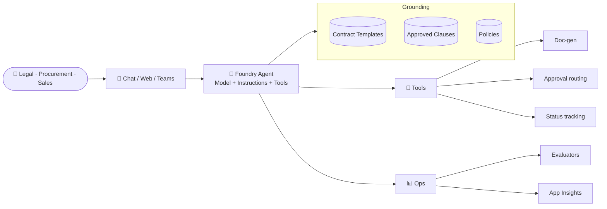

# Landing page

Welcome to the **Contract Intake &amp; Drafting Agent** Microsoft Foundry MicroHack.

This is a **one-day, challenge-based** hack that takes you from *"I have a Foundry account"* to *"I have a governed, evaluated, deployed contract agent"* in nine focused challenges.

## 🎬 The story

A global enterprise's Legal and Procurement teams take dozens of contract intake requests every week:

> *"I need a mutual NDA with Contoso for a joint discovery workshop starting Aug 1."*
>
> *"Please draft a services SOW for our engagement with Fabrikam, 3 months, T&amp;M."*
>
> *"We need to renew the Northwind MSA — reuse standard clauses but bump the liability cap back to 6 months of fees."*

Today they answer these by hand — searching SharePoint for the latest template, copying an approved liability clause from the wiki, checking the procurement policy, drafting in Word, and emailing Legal for approval.

Your job in this MicroHack is to give them an **AI teammate** that does all of that consistently, safely, and with a full audit trail.

## 🛠️ What you'll build

## 🧭 The 9-challenge journey

| # | Title | You will… |
| --- | --- | --- |
| 0 | [Setup](challenges/challenge-0-setup/README.md) | Provision the project, model, storage, identity. |
| 1 | [Build the Agent](challenges/challenge-1-build-agent/README.md) | Create the agent + a contract-drafting persona. |
| 2 | [Knowledge Grounding](challenges/challenge-2-knowledge-grounding/README.md) | Index templates + policies + clauses; enable RAG. |
| 3 | [Tools &amp; Actions](challenges/challenge-3-tools-actions/README.md) | Add clause lookup, doc-gen, and approval routing. |
| 4 | [Guardrails](challenges/challenge-4-guardrails/README.md) | Enforce templates; block sensitive-data leakage. |
| 5 | [Observability](challenges/challenge-5-observability/README.md) | Trace every turn; build cost and quality dashboards. |
| 6 | [Evaluation](challenges/challenge-6-evaluation/README.md) | Score groundedness, task adherence, and safety. |
| 7 | [Optimization](challenges/challenge-7-optimization/README.md) | Tune model, prompt, retrieval, and cost. |
| 8 | [Publish](challenges/challenge-8-publish/README.md) | Deploy to Web App, Teams, and an API endpoint. |

## 🧑‍💻 Two paths, one hack

- **Low-code / portal path** — for business users and PMs. Everything in the [Foundry portal](https://ai.azure.com).
- **Pro-code / SDK path** — for developers. Python SDK in [`app/`](../app/) using `azure-ai-projects` + `azure-identity`.

Both paths land at the **same success criteria** at the end of each challenge.

## ✅ Success looks like

At the end of the day, your agent:

- Retrieves the right **template** for any intake request.
- Populates it with **approved clauses** with citations.
- **Refuses** intake requests that violate policy.
- Emits **traces** you can inspect in Application Insights.
- Scores ≥ 4.0 on **groundedness** and ≥ 4.25 on **task adherence** in the eval dataset.
- Is **deployed** to at least one channel (Web, Teams, or API) with Managed Identity.

Ready? → **[Challenge 0 — Setup](challenges/challenge-0-setup/README.md)**.
