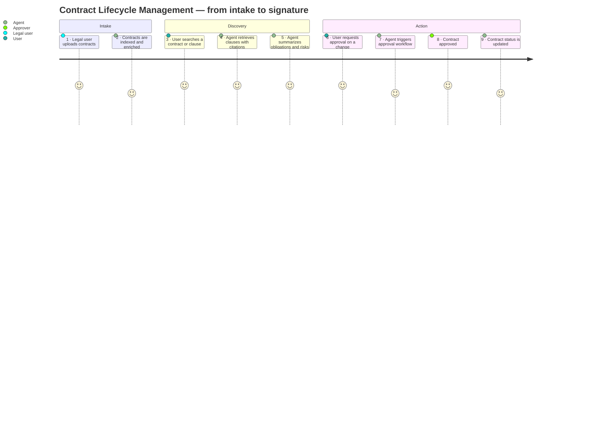
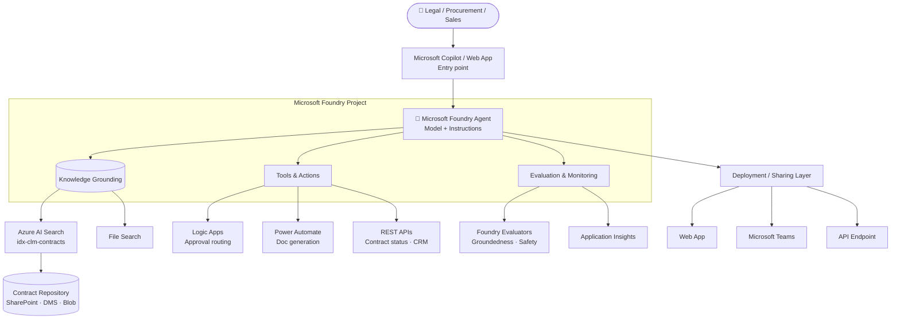

# Contract Lifecycle Management Agent MicroHack

**Build, Ground, Evaluate, and Deploy an AI Contract Management Solution using Microsoft Foundry.**

> A hands-on, challenge-based MicroHack that takes an idea from *"a prompt in a chat window"* to *"a governed, evaluated, deployed CLM agent"* — using **Microsoft Foundry**.

<p align="center">
  <a href="docs/challenge-1-build-agent.md">🏗️ Build</a> ·
  <a href="docs/challenge-2-grounding.md">📚 Ground</a> ·
  <a href="docs/challenge-3-tools-actions.md">🔌 Tools</a> ·
  <a href="docs/challenge-4-evaluation.md">📊 Evaluate</a> ·
  <a href="docs/challenge-5-deploy-share.md">🚀 Deploy</a>
</p>

---

## 🌟 Overview

Enterprise contract portfolios are large, unstructured, and expensive to reason about. Legal teams spend hours locating clauses, procurement teams struggle to compare vendor agreements, and sales teams wait days for turnaround on standard templates. This MicroHack shows you how to give them a **real AI teammate** built on **Microsoft Foundry**.

By the end of the session you will have built a **Contract Lifecycle Management Agent** that can:

- 🔎 **Search contracts** across the enterprise repository.
- 📄 **Retrieve clauses** — termination, liability, indemnity, GDPR, payment terms.
- ⚖️ **Compare agreements** side by side.
- 🧠 **Explain contract terms** in plain business language.
- 📝 **Draft contract summaries** with obligations and key dates.
- 🚦 **Route approvals** through Logic Apps.
- 🏗️ **Generate contract documents** from templates.
- 📊 **Track contract status** across the lifecycle.
- 🚨 **Identify risks and missing clauses** proactively.

## 🧭 Challenge navigation

| # | Challenge | Description | Key Foundry feature | Link |
| --- | --- | --- | --- | --- |
| **1** | **Build the Agent** | Create the base CLM Agent — model + instructions + contract-expert persona. | Foundry **Agent Service** | [→ open](docs/challenge-1-build-agent.md) |
| **2** | **Ground the Agent with Knowledge** | Give the agent access to the contract repository and enable RAG. | **Foundry IQ** on **Azure AI Search** + **File Search** | [→ open](docs/challenge-2-grounding.md) |
| **3** | **Tools and Actions** | Move from chatbot to agent — clause search, approvals, doc-gen, status tracking. | **Tools catalog**, **Logic Apps**, **Power Automate**, **Azure Functions** | [→ open](docs/challenge-3-tools-actions.md) |
| **4** | **Evaluation and Optimization** | Measure accuracy, groundedness, and safety. Set a shippable bar. | **Foundry Evaluators** + **Content Safety** | [→ open](docs/challenge-4-evaluation.md) |
| **5** | **Deploy and Share** | Ship as a Web App, a Teams App, and an API. Governance included. | **Foundry Deploy** + Web / Teams / API endpoints | [→ open](docs/challenge-5-deploy-share.md) |

## 🧑‍💼 User journey

The CLM Agent supports the full contract lifecycle — nine real-world steps:



Or as a flow:

```mermaid
flowchart LR
    S1([1 · Upload contracts]) --> S2([2 · Index and enrich])
    S2 --> S3([3 · Search a contract])
    S3 --> S4([4 · Retrieve clauses])
    S4 --> S5([5 · Summarize obligations])
    S5 --> S6([6 · Request approval])
    S6 --> S7([7 · Trigger workflow])
    S7 --> S8([8 · Contract approved])
    S8 --> S9([9 · Update status])
```



See [`assets/user-journey.md`](assets/user-journey.md) for the full narrative with example prompts and expected outputs.

## 🏗️ Architecture



See [`assets/architecture-diagram.md`](assets/architecture-diagram.md) for the annotated diagram and design notes.

## ✅ Prerequisites

Before you start, make sure you have:

- 🧠 **Microsoft Foundry** access — a project on [ai.azure.com](https://ai.azure.com).
- ☁️ An **Azure subscription** or a Foundry sandbox.
- 📄 A handful of **sample contracts** — MSA, NDA, SOW, vendor agreements. Real or synthetic.
- 📚 **Basic understanding** of what an agent is (model + instructions + tools).
- 🧰 **Optional:** VS Code, GitHub Copilot, `az` CLI.

## 🎯 Learning objectives

After completing this MicroHack you will know how to:

- 🏗️ **Build an agent** in Microsoft Foundry with a strong domain persona.
- 📚 **Ground an agent** with an enterprise contract repository.
- 🔌 **Connect tools and actions** to make the agent *do*, not just *say*.
- 📊 **Evaluate agent quality, groundedness, and safety** — and set a real deployment gate.
- 🚀 **Deploy and share** the solution to Web, Teams, and an API endpoint.

## 📂 Repository structure

```
├── README.md
├── landing-page.md               ← you are here
├── index.html                    ← polished HTML landing page
├── docs/
│   ├── challenge-1-build-agent.md
│   ├── challenge-2-grounding.md
│   ├── challenge-3-tools-actions.md
│   ├── challenge-4-evaluation.md
│   └── challenge-5-deploy-share.md
└── assets/
    ├── architecture-diagram.md
    └── user-journey.md
```

## 🚀 Getting started

1. **Clone the repo:**

   ```bash
   git clone https://github.com/<your-org>/MS-Foundry-Microhack.git
   cd MS-Foundry-Microhack
   ```

2. **Pick your entry point:**

   - Read [`README.md`](README.md) for the repo overview.
   - Read this file ([`landing-page.md`](landing-page.md)) for the docs-style landing page.
   - Open [`index.html`](index.html) in a browser — or publish to GitHub Pages — for the visual landing page.

3. **Work the challenges in order** starting with [Challenge 1 — Build the Agent](docs/challenge-1-build-agent.md).

## 💬 Get help

- Every challenge ends with a **Success Criteria** checklist and a **Next Steps** bridge — use those to unblock.
- Stuck on grounding? Re-read the *"cite your sources"* instruction block in Challenge 2.
- Stuck on tools? Check that your tool descriptions are unambiguous — the model routes on those strings.
- Stuck on eval? Start with a 10–15 row test set; grow it later.

Good luck — and welcome to Foundry.
